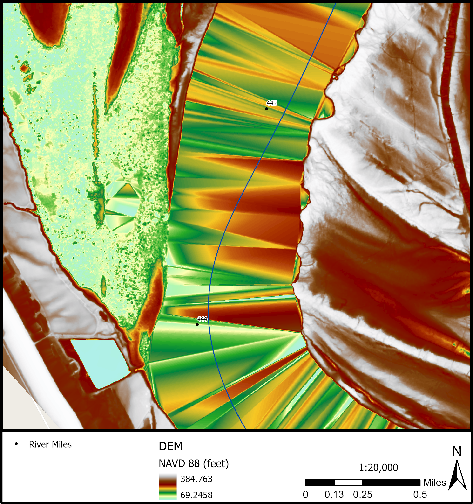

# Concepts


## Fluvial Geomorphology
This section will discuss 

### Reach
hierarchical levels: project study area, site, reach

### Flowline {#flowline-concept}
* centerline
* thalweg

### Position Along River

### Pool-Riffle-Run

### Cross Section {#xs-concept}

### Bankfull {#bankfull-concept}

### Flood Prone {#flood-prone-concept}

### Planform {planform-concept}
* loops contain bends
* loops have an apex
* loops alternate
* crossovers
* Valley Line


## Geospatial

### LiDAR Stream Measurement
* discuss the difference between water surface and channel bottom
* diagram of stream

### Terrain Models
* point cloud
* raster
* surface models, terrain models

### Terrain Visualization {#terrain-visualization-concept}

### Synthetic Stream Delineation {#synthetic-stream-concept}

### Flow Accumulation {#flow-accumulation-concept}

### Hydro Modification {#hydro-modification-concept}

### Detrending {#detrending-concept}


* "relative bank height"
* figure: side-by-side DEM and detrend
* figure: side-by-side longitudinal profiles

### Water Surface Elevation
Since water almost completely absorbs LiDAR light pulses, areas of water are usually missing elevation data. However, this does not mean that water surface elevation (WSE) cannot be derived from or accurately represented in LiDAR datasets. The elevation of water areas in DEMs derived from LiDAR point clouds can be represented due to the acquisition of points along the water's edge. See Figure x1 for an illustration of where these points are located.

```{r echo=FALSE, fig.cap="LiDAR Points Acquired Close to the Water's Edge Define the Water Surface. Mississippi River, RM 435, Vicksburg, MS.", out.width="100%"}
knitr::include_graphics("figures/water_edge_lidar_points.png")
```

The point cloud density will largely determine how accurately the water surface is captured, driven by the probability of capturing points as close to the water line as possible. In relatively low point cloud density LiDAR collections (>=1m point cloud spacing) the water surface is often represented with artifacts. These artifacts are commonly referred to as TIN (Triangulated Irregular Networks) artifacts created when the DEM is derived. These occur when LiDAR points were not regularly acquired close to the water's edge. Sections of the banklines where LiDAR points were not acquired close to the water's edge will appear as triangular "humps" in the water surface. In Figure x2, these "hump" artifacts are clearly visible as reddish areas, while the lower elevation areas close to the water surface elevation appears as green and blue areas. 

```{r echo=FALSE, fig.cap="DEM artifacts due to LiDAR points not being captured close enough to the water's edge. Mississippi River, RM 444-445.", out.width="100%"}

```


### Spatial Data Clearinghouses for Terrain Data
* 3DEP
* The National Map
* State clearinghouses
