# Toolbox
This chapter describes the FluvialGeomorph toolbox structure and the products it creates. This chapter begins with a description of the platforms used, the structure of the FluvialGeomorph ArcGIS toolbox and concludes with a description of the products created. 


## Platforms
The FluvialGeomorph toolbox uses [ESRI](https://www.esri.com/en-us/home) and open source software to combine several platforms, each chosen based on their strengths, to construct a custom toolbox for rapid fluvial geomorphology analysis. 

* [ArcGIS Desktop](https://desktop.arcgis.com/en/) -Desktop (ArcMap and ArcGIS Pro) are industry standard enterprise desktop GIS products for conducting geospatial analysis. The ArcGIS desktop applications contain an enormous number of commercial-off-the shelf (COTS) geospatial tools for performing sophisticated analyses and visualization. 
* [ArcGIS toolbox](https://pro.arcgis.com/en/pro-app/latest/help/analysis/geoprocessing/basics/use-a-custom-geoprocessing-tool.htm) - ArcGIS Desktop allows for the creation of sophisticated custom geospatial toolboxes to be built that combine ESRI's COTS geoprocessing tools with user created tools from several platforms (e.g., Python, R). 
* [Python](https://www.python.org/) - ArcGIS provides a robust scripting interface to its GIS tools using the Python language. Custom geospatial toolboxes can combine ESRI's COTS geoprocessing tools with tools available within the diverse, mature, and ever-growing Python data science ecosystem. 
* [R](https://cran.r-project.org/) - ESRI's [ArcGIS R-bridge](https://github.com/R-ArcGIS/r-bridge) product allows R tools to be called within the ArcGIS toolbox interface. This allows ArcGIS tools to take advantage of the mature ecosystem of R data science, statistical, visualization, and report generation packages. 


## Packages
The FluvialGeomorph toolbox is composed of a set of tightly connected packages that work together to complete the analysis. Modular design was a conscious architectural decision made to take advantage of the best tools and to help support long-term maintenance. Links are provided below to each package's online code repository. 

* The [`FluvialGeomorph`](https://github.com/FluvialGeomorph/FluvialGeomorph-toolbox) toolbox - This is the primary user-facing software component. It is an ArcGIS toolbox organized as a Python package. The custom Python tools in this toolbox perform primarily geospatial operations, where the ESRI platform excels (e.g., linear referencing). It also performs the installation of the needed R packages. 
* The [`fluvgeo`](https://github.com/FluvialGeomorph/fluvgeo) R package - This custom R package developed for this project contains the bulk of the data science, statistical, visualization, and reporting functions, where the R platform excels. 
* The [`RegionalCurve`](https://github.com/FluvialGeomorph/RegionalCurve) R package - This custom R package developed for this project contains the data and functions for accessing regional hydraulic geometry studies. 


## ArcGIS Toolbox
The FluvialGeomorph toolbox contains a set of tools for analyzing streams. These tools are divided into four toolsets. 

### 01 - Install toolset
The purpose of this toolset is to hold the tools needed to install and troubleshoot the FluvialGeomorph toolbox software components. 

#### `Install R Packages`
**Purpose** - This tool installs the R packages required by the FluvialGeomorph toolbox using these instructions in the [user manual](https://www.usermanual.fluvialgeomorph.org/install.html#install-fluvialgeomorph). This tool also sets several configuration settings. 

**Code** - This ArcGIS script tool calls the R script [`FluvialGeomorph-toolbox/install/Install_FG_R.R`](https://github.com/FluvialGeomorph/FluvialGeomorph-toolbox/blob/master/install/Install_FG_R.R). 

***

#### `R Session Info`
**Purpose** - This tool provides the output of the current R session. This is helpful for troubleshooting R environment issues during installation. 

**Code** - This ArcGIS script tool calls the R script [`FluvialGeomorph-toolbox/install/session.R`](https://github.com/FluvialGeomorph/FluvialGeomorph-toolbox/blob/master/install/session.R). 

***

### 02 - Tools toolset
The purpose of this toolset is to hold the tools that perform the FluvialGeomorph analysis. 

#### `02 - Hydro DEM` {#hydro-dem-tool}
**Purpose** - This tool "burns" (sets the elevation to the same value for all pixels along the extent of the polyline feature) a [`cutlines`](#cutlines-fc) feature class into the supplied DEM and creates the [`dem_hydro`](#dem-hydro-raster) in the output workspace using these instructions in the [user manual](https://www.usermanual.fluvialgeomorph.org/level-1-workflow.html#hydro-modify-dem). See [this section](#hydro-modification-concept) for a detailed discussion of why hydro modification is required. 

**Code** - This ArcGIS script tool calls the Python script [`FluvialGeomorph-toolbox/tools/_02_HydroDEM.py`](https://github.com/FluvialGeomorph/FluvialGeomorph-toolbox/blob/master/tools/_02_HydroDEM.py).

**Parameters** - This tool contains the following parameters:
```{r, echo=FALSE}
params_table(params_df, "hydro_dem", "Hydro DEM Tool Parameters.")
```

```{r echo=FALSE, fig.cap="02 - Hydro DEM Tool Dialog."}
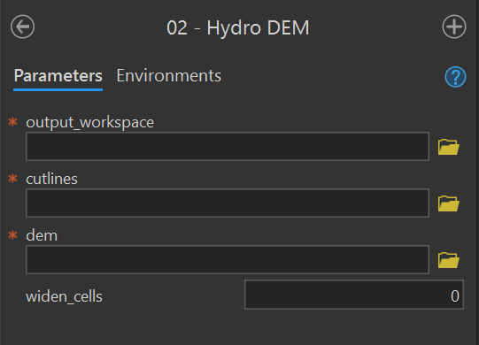
```

***

#### `03 - Contributing Area` {#contributing-area-tool}
**Purpose** - This tool calculates the [D-infinity contributing area](https://hydrology.usu.edu/taudem/taudem5/help53/DInfinityContributingArea.html) for each pixel in the input DEM and creates a [`contributing_area`](#contributing-area-raster) raster in the output workspace using these instructions in the [user manual](https://www.usermanual.fluvialgeomorph.org/level-1-workflow.html#calculate-contributing-area). 

**Code** - This ArcGIS script tool calls the Python script [`FluvialGeomorph-toolbox/tools/_03_ContributingArea.py`](https://github.com/FluvialGeomorph/FluvialGeomorph-toolbox/blob/master/tools/_03_ContributingArea.py). This Python script uses the [TauDEM](https://hydrology.usu.edu/taudem/taudem5/index.html) [D-Infinity Contributing Area tool](https://hydrology.usu.edu/taudem/taudem5/help53/DInfinityContributingArea.html) to calculate the specific catchment area (which is the contributing area per unit contour length using the multiple flow direction D-infinity approach).

**Parameters** - This tool contains the following parameters:
```{r, echo=FALSE}
params_table(params_df, "contributing_area", "Contributing Area Tool Parameters.")
```

```{r echo=FALSE, fig.cap="03 - Contributing Area Tool."}
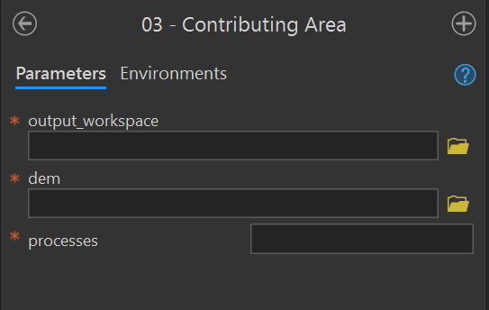
```

***

#### `03a - Contributing Area D8` {#contributing-area-d8-tool}
**Purpose** - This tool creates the D8 [`flow_accumulation_d8`](#flow-accumulation-raster) and [`flow_direction_d8`](#flow-direction-raster) rasters in the output workspace for a given input DEM using these instructions in the [user manual](https://www.usermanual.fluvialgeomorph.org/level-1-workflow.html#calculate-contributing-area).  

**Code** - This ArcGIS script tool calls the Python script [`FluvialGeomorph-toolbox/tools/_03a_ContributingAreaD8.py`](https://github.com/FluvialGeomorph/FluvialGeomorph-toolbox/blob/master/tools/_03a_ContributingAreaD8.py). 

**Parameters** - This tool contains the following parameters:
```{r, echo=FALSE}
params_table(params_df, "contributing_area_D8", "Contributing Area D8 Tool Parameters.")
```

```{r echo=FALSE, fig.cap="03a - Contributing Area D8 Tool."}
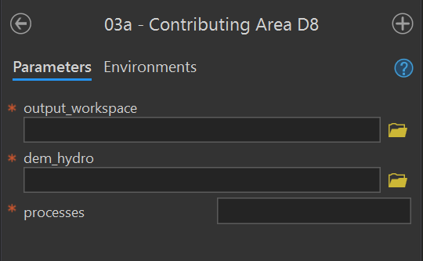
```

***

#### `04 - Stream Network` {#stream-network-tool}
**Purpose** - This tool creates the synthetic flow network [`stream_network`](#stream-network-fc) polyline feature class from a [`contributing_area`](#contributing-area-raster) raster for a given stream initiation threshold using these instruction in the [user manual](https://www.usermanual.fluvialgeomorph.org/level-1-workflow.html#derive-stream-network). 

**Code** - The ArcGIS script tool calls the Python script [`FluvialGeomorph-toolbox/tools/_04_StreamNetwork.py`](https://github.com/FluvialGeomorph/FluvialGeomorph-toolbox/blob/master/tools/_04_StreamNetwork.py). 

**Parameters** - This tool contains the following parameters:
```{r, echo=FALSE}
params_table(params_df, "stream_network", "Stream Network Tool Parameters.")
```

```{r echo=FALSE, fig.cap="04 - Stream Network Tool."}
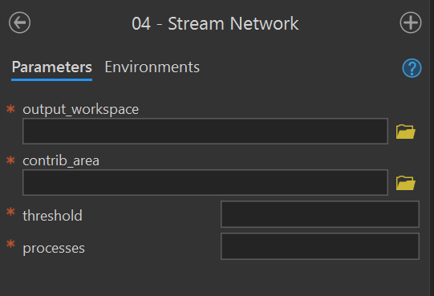
```

***

#### `04a - Stream Network Points` {#stream-network-points-tool}
**Purpose** - This tool converts the [`stream_network`](#stream-network-fc) to the [`stream_network_points`](#stream-network-points-fc) points feature class using the these instructions from the [user manual](https://www.usermanual.fluvialgeomorph.org/level-1-workflow.html#create-flowline-points). This tool extracts elevation information from the DEM and calculates the drainage area. 

**Code** - This ArcGIS script tool calls the Python script [`FluvialGeomorph-toolbox/tools/_04a_StreamNetworkPoints.py`](https://github.com/FluvialGeomorph/FluvialGeomorph-toolbox/blob/master/tools/_04a_StreamNetworkPoints.py). 

**Parameters** - This tool contains the following parameters:
```{r, echo=FALSE}
params_table(params_df, "stream_network_points", "Stream Network Points Tool Parameters.")
```

```{r echo=FALSE, fig.cap="04a - Stream Network Point Tool."}
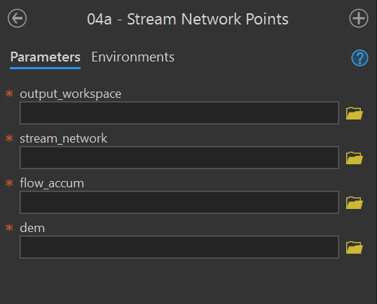
```

***

#### `04b - Slope and Sinuosity` {#slope-sinuosity-tool}
**Purpose** - This tool calculates the [`gradient_*`](#gradient-fc) points feature class for a [`flowline_points`](#flowline-points-fc) or [`stream_network`](#stream-network-fc) feature class using these instructions from the [user manual](https://www.usermanual.fluvialgeomorph.org/level-1-workflow.html#calculate-slope-and-sinuosity). 

**Code** - This ArcGIS script tool calls the Python script [`FluvialGeomorph-toolbox/tools/_04b_Gradient.R`](https://github.com/FluvialGeomorph/FluvialGeomorph-toolbox/blob/master/tools/_04b_Gradient.R). This Python script call the R function [`fluvgeo::slope_sinuosity`](https://github.com/FluvialGeomorph/fluvgeo/blob/master/R/slope_sinuosity.R). 

**Parameters** - This tool contains the following parameters:
```{r, echo=FALSE}
params_table(params_df, "slope_sinuosity", "Stream Network Points Tool Parameters.")
```

```{r echo=FALSE, fig.cap="04b - Slope and Sinuosity Tool."}
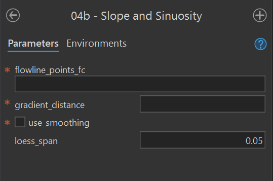
```

***

#### `04c - Watershed` {#watershed-tool}
**Purpose** - This tool creates the [`watershed`](#watershed-fc) polygon feature class in the output workspace using these instructions from the [user manual](https://www.usermanual.fluvialgeomorph.org/level-1-workflow.html#delineate-watersheds). This tool calculates the extent of the upstream drainage area for each point feature in the input [`watershed_points`](#watershed-points-fc) point feature class. This tool optionally calculates the landcover proportion in each watershed feature. 

**Code** - This ArcGIS script tool calls the Python script  [`FluvialGeomorph-toolbox/tools/_04c_Watersheds.py`](https://github.com/FluvialGeomorph/FluvialGeomorph-toolbox/blob/master/tools/_04c_Watersheds.py). 

**Parameters** - This tool contains the following parameters:
```{r, echo=FALSE}
params_table(params_df, "watershed", "Watershed Tool Parameters.")
```

```{r echo=FALSE, fig.cap="04c - Watershed Tool."}
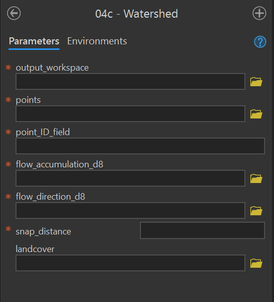
```

***

#### `05 - Flowline` {#flowline-tool}
**Purpose** - This tool creates a [`flowline`](#flowline-fc) feature class in the output workspace using these instructions from the [user manual](https://www.usermanual.fluvialgeomorph.org/level-1-workflow.html#create-the-flowline). This tool uses an edited [`stream_network`](#stream-network-fc) feature class to derive the [`flowline`](#flowline-fc). 

**Code** - This ArcGIS script tool calls the Python script [`FluvialGeomorph-toolbox/tools/_05_Flowline.py`](https://github.com/FluvialGeomorph/FluvialGeomorph-toolbox/blob/master/tools/_05_Flowline.py). 

**Parameters** - This tool contains the following parameters: 
```{r, echo=FALSE}
params_table(params_df, "flowline", "Flowline Tool Parameters.")
```

```{r echo=FALSE, fig.cap="05 - Flowline Tool."}
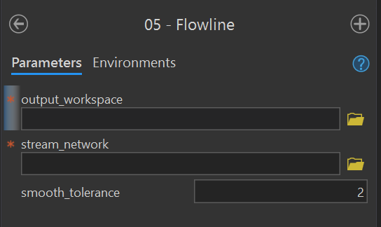
```

***

#### `06 - Flowline Points` {#flowline-points-tool}
**Purpose** - This tool creates a [`flowline_points`](#flowline-points-fc) feature class in the output workspace using these instructions from the [user manual](https://www.usermanual.fluvialgeomorph.org/level-1-workflow.html#create-flowline-points). This tool converts a stream [`flowline`](#flowline-fc) feature class to a route and begins the stationing using the `km_to_mouth` parameter. This tool can optionally calibrate the output [`flowline_points`](#flowline-points-fc) using a point feature class. 

**Code** - This ArcGIS script tool calls the Python script  [`FluvialGeomorph-toolbox/tools/_06_FlowlinePoints.py`](https://github.com/FluvialGeomorph/FluvialGeomorph-toolbox/blob/master/tools/_06_FlowlinePoints.py). 

**Parameters** - This tool contains the following parameters: 
```{r, echo=FALSE}
params_table(params_df, "flowline_points", "Flowline Points Tool Parameters.")
```

```{r echo=FALSE, fig.cap="06 - Flowline Points Tool."}
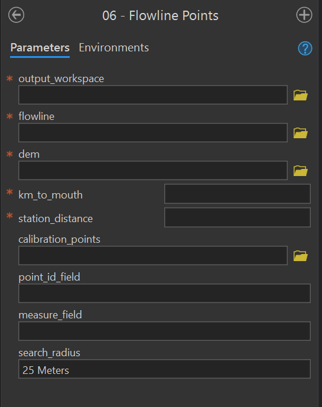
```

***

#### `07 - Detrend DEM` {#detrend-dem-tool}
This tool creates the [`detrend`](#detrend-raster) raster using these instructions from the [user manual](https://www.usermanual.fluvialgeomorph.org/level-1-workflow.html#define-initial-floodplain-and-channel-extent). This tool uses [`flowline_points`](#flowline-points-fc) to remove the elevation trend from the stream reach. See [this section](#detrending-concept) for a detailed discussion on detrended DEMs. 

**Code** - This ArcGIS script tool calls the Python script [`FluvialGeomorph-toolbox/tools/_07_DetrendDEM.py`](https://github.com/FluvialGeomorph/FluvialGeomorph-toolbox/blob/master/tools/_07_DetrendDEM.py). 

**Parameters** - This tool contains the following parameters: 
```{r, echo=FALSE}
params_table(params_df, "detrend_dem", "Detrend DEM Tool Parameters.")
```

```{r echo=FALSE, fig.cap="07 - Detrend Tool."}
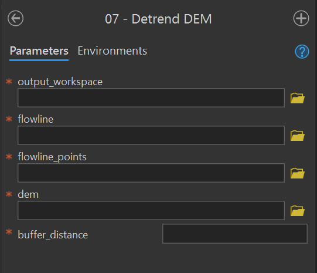
```

***

#### `08 - Water Surface Extent` {#water-surface-extent}
**Purpose** - This tool creates the [`banks_raw`](#bankfull-area-fc) polygon feature class using these Level 1 instructions from the [user manual](https://www.usermanual.fluvialgeomorph.org/level-1-workflow.html#estimate-initial-channel-extent) and [these instructions](https://www.usermanual.fluvialgeomorph.org/level-2-workflow.html#create-bankfull-area) for Level 2.

**Code** - This ArcGIS script tool calls the Python script [FluvialGeomorph-toolbox/tools/_08_WaterSurfaceExtent.py](https://github.com/FluvialGeomorph/FluvialGeomorph-toolbox/blob/master/tools/_08_WaterSurfaceExtent.py).

**Parameters** - This tool contains the following parameters: 
```{r, echo=FALSE}
params_table(params_df, "water_surface_extent", "Water Surface Extent Tool Parameters.")
```

```{r echo=FALSE, fig.cap="08 - Water Surface Extent Tool."}
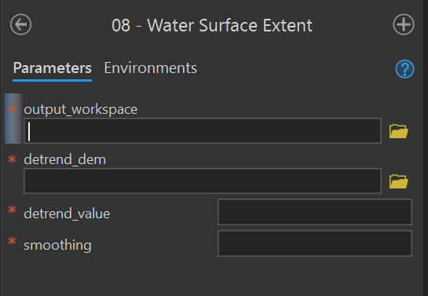
```

***

#### `09 - Channel Slope` {#channel-slope-tool}
**Purpose** - This tool creates the [`channel_slope`](#channel-slope-raster) raster using these instructions in the [user manual](https://www.usermanual.fluvialgeomorph.org/level-1-workflow.html#calculate-channel-slope-raster). This tool uses banks extent polygon to calculate a slope raster for the channel area. 

**Code** - This ArcGIS script tool calls the Python script [`FluvialGeomorph-toolbox/tools/_09_ChannelSlope.py`](https://github.com/FluvialGeomorph/FluvialGeomorph-toolbox/blob/master/tools/_09_ChannelSlope.py). 

**Parameters** - This tool contains the following parameters: 
```{r, echo=FALSE}
params_table(params_df, "channel_slope", "Channel Slope Tool Parameters.")
```

```{r echo=FALSE, fig.cap="09 - Channel Slope Tool."}
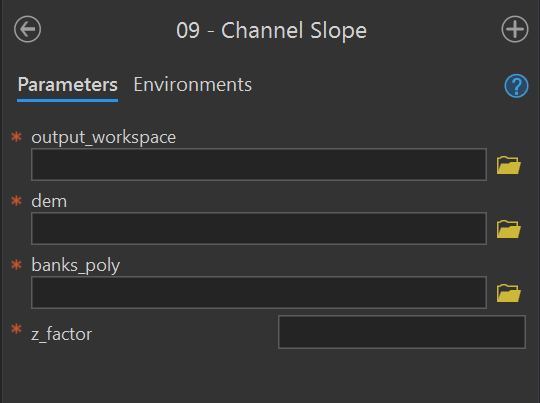
```

***

#### `10 - Centerline` {#centerline-tool}
**Purpose** - This tool creates the [`centerline`](#centerline-fc) polyline feature class using these instructions for [Level 1](https://www.usermanual.fluvialgeomorph.org/level-1-workflow.html#create-initial-centerline) and [Level 2](https://www.usermanual.fluvialgeomorph.org/level-1-workflow.html#create-initial-centerline) from the user manual. The centerline is the strem flow path that lies midway between the banks at bankfull. 

**Code** - This ArcGIS script tool calls the Python script [`FluvialGeomorph-toolbox/tools/_10_Centerline.py`](https://github.com/FluvialGeomorph/FluvialGeomorph-toolbox/blob/master/tools/_10_Centerline.py).

**Parameters** - This tool contains the following parameters: 
```{r, echo=FALSE}
params_table(params_df, "centerline", "Centerline Tool Parameters.")
```

```{r echo=FALSE, fig.cap="10 - Centerline Tool."}
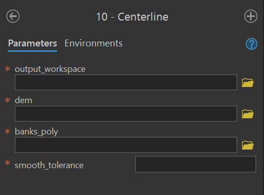
```

***

#### `11 - XS Layout` {#xs-layout-tool}
**Purpose** - This tool creates the [`xs_*`](#regular-xs-fc) polyline feature class using these instructions from the [user manual](https://www.usermanual.fluvialgeomorph.org/level-1-workflow.html#create-regular-cross-section-geometry). This tool creates a set of regularly spaced cross sections along the input [`flowline`](#flowline-fc) at the specified longitudinal spacing and lateral width. The output feature class is named `xs_<transect_spacing>_<transect_width>`. 

**Code** - This ArcGIS script tool calls the Python script [`FluvialGeomorph-toolbox/tools/_11_XSLayout.py`](https://github.com/FluvialGeomorph/FluvialGeomorph-toolbox/blob/master/tools/_11_XSLayout.py).

**Parameters** - This tool contains the following parameters: 
```{r, echo=FALSE}
params_table(params_df, "xs_layout", "Cross Section Layout Tool Parameters.")
```

```{r echo=FALSE, fig.cap="11 - XS Layout Tool."}
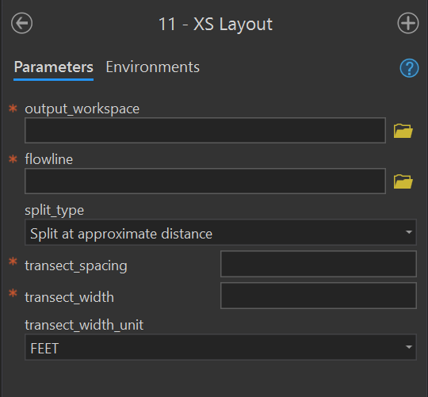
```

***

#### `12 - XS Watershed Area` {#xs-watershed-area-tool}
**Purpose** - This tool adds or updates the field `Watershed_Area_SqMile` to the input cross section feature class using these instructions for [`Level 1`](https://www.usermanual.fluvialgeomorph.org/level-1-workflow.html#calculate-cross-section-watershed-area) and [`Level 2`](https://www.usermanual.fluvialgeomorph.org/level-2-workflow.html#calculate-cross-section-watershed-area-1) from the user manual. This field records the upstream drainage area for the cross section. 

**Code** - This ArcGIS script tool calls the Python script [`FluvialGeomorph-toolbox/tools/_12_XSWatershedArea.py`](https://github.com/FluvialGeomorph/FluvialGeomorph-toolbox/blob/master/tools/_12_XSWatershedArea.py).

**Parameters** - This tool contains the following parameters: 
```{r, echo=FALSE}
params_table(params_df, "xs_watershed_area", "Cross Section watershed Area Tool Parameters.")
```

```{r echo=FALSE, fig.cap="12 - XS Watershed Area Tool."}
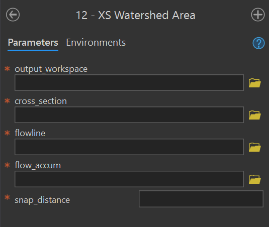
```

***

#### `13 - XS River Position` {#xs-river-position}
**Purpose** - This tool adds or updates the field `km_to_mouth` to the input cross section feature class using these instructions for [`Level 1`](https://www.usermanual.fluvialgeomorph.org/level-1-workflow.html#calculate-cross-section-river-position) and [`Level 2`](https://www.usermanual.fluvialgeomorph.org/level-2-workflow.html#calculate-cross-section-river-position-1) from the user manual. This field records the distance of the cross section from the mouth of the site. 

**Code** - This ArcGIS script tool calls the Python script [`FluvialGeomorph-toolbox/blob/_13_XSRiverPosition.py`](https://github.com/FluvialGeomorph/FluvialGeomorph-toolbox/blob/master/tools/_13_XSRiverPosition.py).

**Parameters** - This tool contains the following parameters: 
```{r, echo=FALSE}
params_table(params_df, "xs_river_position", "Cross Section River Position Tool Parameters.")
```

```{r echo=FALSE, fig.cap="13 - XS River Position Tool."}
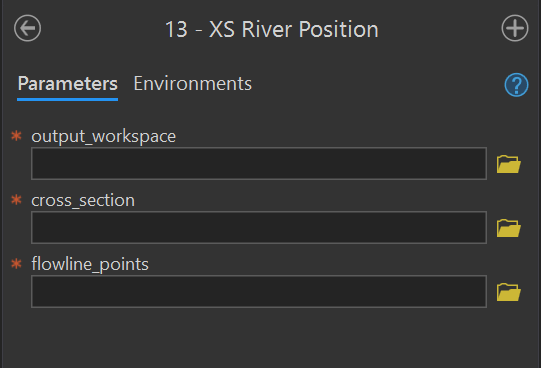
```

***

#### `13a - XS Resequence` {#xs-resequence-tool}
**Purpose** - This tools reorders the values of the `Seq` field for the input cross section feature class using these instructions from the [user manual](https://www.usermanual.fluvialgeomorph.org/level-1-workflow.html#create-regular-cross-sections). 

**Code** - This ArcGIS script tool calls the Python script [`FluvialGeomorph-toolbox/tools/_13a_XSResequence.py`](https://github.com/FluvialGeomorph/FluvialGeomorph-toolbox/blob/master/tools/_13a_XSResequence.py). 

**Parameters** - This tool contains the following parameters: 
```{r, echo=FALSE}
params_table(params_df, "xs_resequence", "Cross Section Resequence Tool Parameters.")
```

```{r echo=FALSE, fig.cap="13a - XS Resequence Tool."}
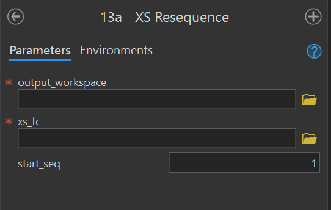
```

***

#### `14 - XS Points` {#xs-points-tool}
**Purpose** - This tool creates the [`*_points`](#xs-points-fc) points feature class using the these instructions for [Level 1](https://www.usermanual.fluvialgeomorph.org/level-1-workflow.html#calculate-cross-section-points) and [Level 2](https://www.usermanual.fluvialgeomorph.org/level-2-workflow.html#calculate-cross-section-points-1) from the user manual. This tool converts a cross section polyline feature class (i.e., `xs_*`, `riffle_floodplain`, `riffle_channel`) into a series of points stationed at the `station_distance` along the input cross section. The name of the input cross section prepended to the output feature class: `<cross_section name>_points`. 

**Code** - This ArcGIS script tool calls the Python script [`FluvialGeomorph-toolbox/tools/_14_XSPoints.py`](https://github.com/FluvialGeomorph/FluvialGeomorph-toolbox/blob/master/tools/_14_XSPoints.py).

**Parameters** - This tool contains the following parameters: 
```{r, echo=FALSE}
params_table(params_df, "xs_points", "Cross Section Points Tool Parameters.")
```

```{r echo=FALSE, fig.cap="14 - XS Points Tool."}
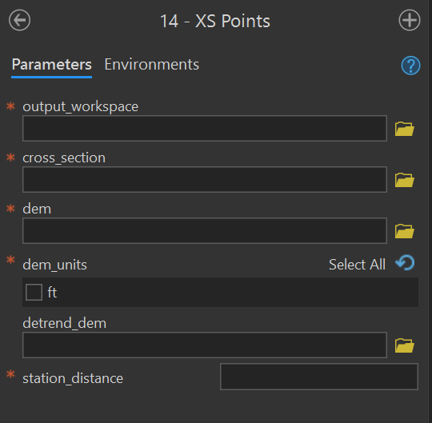
```

***

#### `14b - Bankline Points` {#bankline-points-tool}
**Purpose** - This tool creates the [`bankline_points`](#bankline-points-fc) using these instructions in the [user manual](https://www.usermanual.fluvialgeomorph.org/level-3-workflow.html#derive-bankline-points). This tool uses the [`loop_points`](#loop-points-fc) and [`valleyline`](#valleyline-fc) that the analyst manually created in previous steps. 

**Code** - This ArcGIS script tool calls the Python script [`FluvialGeomorph-toolbox/tools/_14b_BanklinePoints.py`](https://github.com/FluvialGeomorph/FluvialGeomorph-toolbox/blob/master/tools/_14b_BanklinePoints.py)

**Parameters** - This tool contains the following parameters: 
```{r, echo=FALSE}
params_table(params_df, "bankline_points", "Bankline Points Tool Parameters.")
```

```{r echo=FALSE, fig.cap="14b - Bankline Points Tool."}
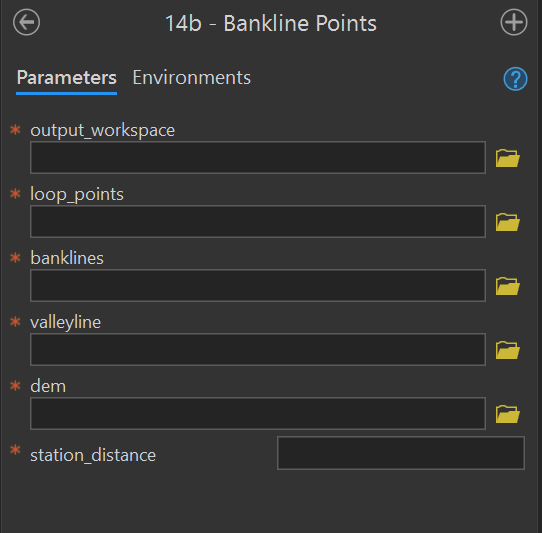
```

***

#### `14c - XS Assign Loops` {#xs-assign-loops-tool}
**Purpose** - This tool assigns loops and bends to input cross section feature class using the input [`bankline_points`](#bankline-points-fc) using these instructions in the [user manual](https://www.usermanual.fluvialgeomorph.org/level-3-workflow.html#assign-cross-section-loops). 

**Code** - This ArcGIS script tool calls the Python script [`FluvialGeomorph-toolbox/tools/_14c_XSAssignLoops.py`](https://github.com/FluvialGeomorph/FluvialGeomorph-toolbox/blob/master/tools/_14c_XSAssignLoops.py). 

**Parameters** - This tool contains the following parameters: 
```{r, echo=FALSE}
params_table(params_df, "assign_loops", "Assign Loops Tool Parameters.")
```

```{r echo=FALSE, fig.cap="14c - XS Assign Loops Tool."}
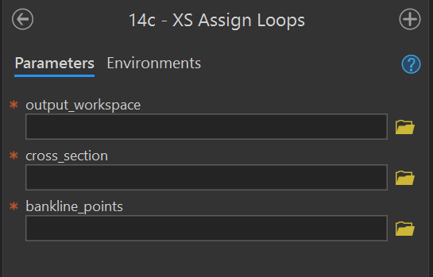
```

***

#### `15a - XS Dimensions, Level 1` {#xs-dimensions-L1-tool}
**purpose** - This tool calculates [Level 1 cross section dimensions](#xs-dimensions-fc) for the input cross section feature class (i.e., [regular cross sections](#regular-xs-fc)) using these instructions from the [user manual](https://www.usermanual.fluvialgeomorph.org/level-1-workflow.html#calculate-cross-section-l1-dimensions).

**Code** - This ArcGIS script tool calls the Python script [FluvialGeomorph-toolbox/tools/_15a_XSDimensions.R](https://github.com/FluvialGeomorph/FluvialGeomorph-toolbox/blob/master/tools/_15a_XSDimensions.R) which calls the R function [`fluvgeo::cross_section_dimensions_L1`](https://github.com/FluvialGeomorph/fluvgeo/blob/master/R/cross_section_dimensions_L1.R). 

**Parameters** - This tool contains the following parameters: 
```{r, echo=FALSE}
params_table(params_df, "xs_dimensions_L1", "XS Dimensions, Level 1 Tool Parameters.")
```

```{r echo=FALSE, fig.cap="15a - XS Dimensions, Level 1 Tool."}
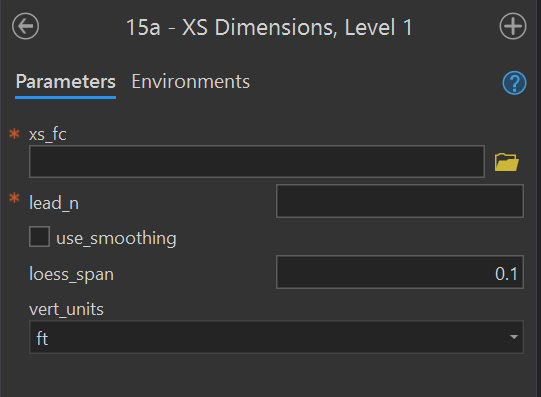
```

***

#### `15b - XS Dimensions, Level 2` {#xs-dimensions-L2-tool}
**Purpose** - This tool calculates [Level 3 cross section dimensions](#xs-dimensions-fc) for the input cross section feature class (i.e., [regular cross sections](#regular-xs-fc), [riffle cross sections](#riffle-xs-fc)) using these instructions from the [user manual](https://www.usermanual.fluvialgeomorph.org/level-2-workflow.html#calculate-final-l2-cross-section-geometry).

**Code** - This ArcGIS script tool calls the Python script [`FluvialGeomorph-toolbox/tools/_15b_XSDimensions.R`](https://github.com/FluvialGeomorph/FluvialGeomorph-toolbox/blob/master/tools/_15b_XSDimensions.R)

**Parameters** - This tool contains the following parameters: 
```{r, echo=FALSE}
params_table(params_df, "xs_dimensions_L2", "XS Dimensions, Level 2 Tool Parameters.")
```

```{r echo=FALSE, fig.cap="15b - XS Dimensions, Level 2 Tool."}
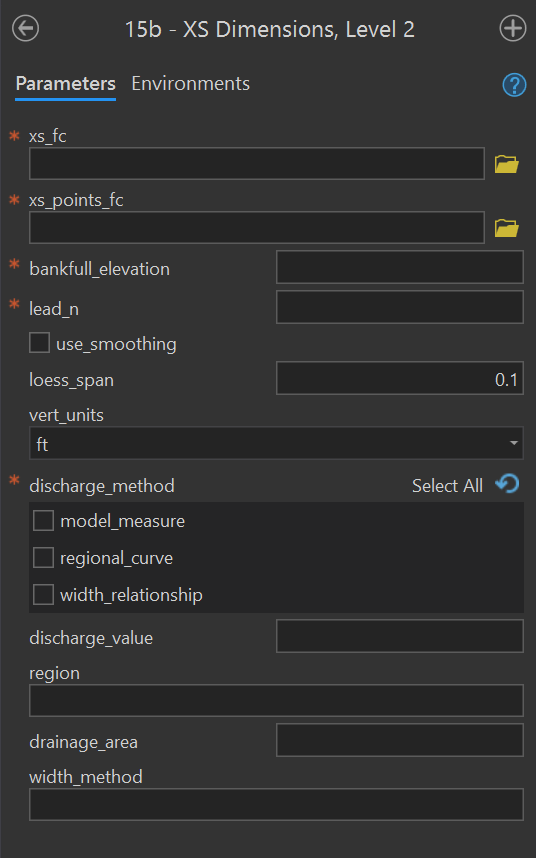
```

***

#### `15c - XS Planform, Level 3` {#xs-dimensions-L3-tool}
**Purpose** - This tool calculates [Level 3 cross section dimensions](#xs-dimensions-fc) for the input cross section feature class (i.e., [regular cross sections](#regular-xs-fc), [riffle cross sections](#riffle-xs-fc)) using these instructions from the [user manual](https://www.usermanual.fluvialgeomorph.org/level-3-workflow.html#calculate-l3-cross-section-geometry). 

**Code** - This ArcGIS script tool calls the Python script [`FluvialGeomorph/FluvialGeomorph-toolbox/tools/_15c_XSPlanform.R`](https://github.com/FluvialGeomorph/FluvialGeomorph-toolbox/blob/master/tools/_15c_XSPlanform.R) which calls the R functions [`fluvgeo::planform_dimensions`](https://github.com/FluvialGeomorph/fluvgeo/blob/master/R/planform_dimensions.R) to calculate the planform dimensions and [`fluvgeo::xs_metric_ratios`](https://github.com/FluvialGeomorph/fluvgeo/blob/master/R/xs_metric_ratios.R) to calculate the metric ratios. 

**Parameters** - This tool contains the following parameters: 
```{r, echo=FALSE}
params_table(params_df, "xs_dimensions_L3", "XS Dimensions, Level 3 Tool Parameters.")
```

```{r echo=FALSE, fig.cap="15b - XS Dimensions, Level 3 Tool."}
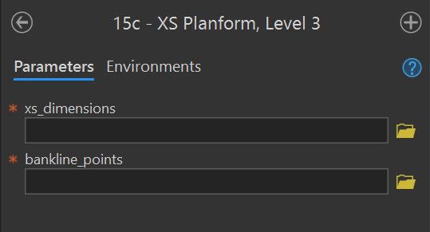
```

***

#### `16 - XS RAS Watersurface` {#xs-ras-watersurface-tool}
**Purpose** - This tool adds or updates the field `ras_wse_*` to a [cross section dimensions](#xs-dimensions-fc) feature class using these instructions for [Level 2](https://www.usermanual.fluvialgeomorph.org/level-2-workflow.html#add-modeled-water-surface-elevation) and [Level 3](https://www.usermanual.fluvialgeomorph.org/level-3-workflow.html#add-modeled-water-surface-elevation-1) from the user manual. 

**Code** - This ArcGIS script tool calls the Python script [`FluvialGeomorph-toolbox/tools/_16_XS_RAS_WaterSurface.py`](https://github.com/FluvialGeomorph/FluvialGeomorph-toolbox/blob/master/tools/_16_XS_RAS_WaterSurface.py). 

**Parameters** - This tool contains the following parameters: 
```{r, echo=FALSE}
params_table(params_df, "ras_watersurface", "XS RAS Watersurface Tool Parameters.")
```

```{r echo=FALSE, fig.cap="16 - XS RAS Watersurface Tool."}
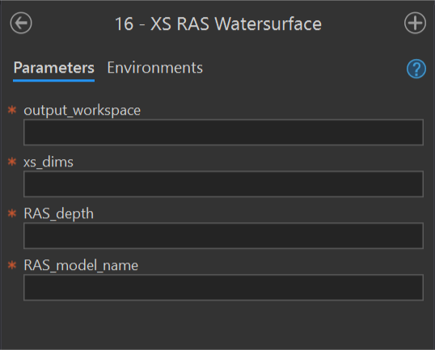
```

### 03 - Reports toolset
The purpose of this toolset is to hold the tools that produce the FluvialGeomorph reports. 

#### `Graph - Longitudinal Profile Compare` {#longitudinal-profile-compare-graph-tool}
**Purpose** - This tool produces the [longitudinal profile plot](#longitudinal-profile-compare-graph) from the [`flowline_points`](#flowline-points-fc) feature classes of a stream reach taken from one or more surveys. This tool compares longitudinal profile plots from multiple surveys. It labels the plot using the [`features`](#features-fc) feature class along the x-axis. 

**Code** - This ArcGIS script tool calls the R script [`FluvialGeomorph-toolbox\report\_Longitudinal_Profile_Compare.R`](https://github.com/FluvialGeomorph/FluvialGeomorph-toolbox/blob/master/report/_Longitudinal_Profile_Compare.R) which calls the R function  [`fluvgeo::compare_long_profile`](https://github.com/FluvialGeomorph/fluvgeo/blob/master/R/compare_long_profile.R). 

**Parameters** - This tool contains the following parameters: 
```{r, echo=FALSE}
params_table(params_df, "longitudinal_profile_compare", "Longitudinal Profile Compare Tool Parameters.")
```

```{r echo=FALSE, fig.cap="Graph - Longitudinal Profile Compare Tool."}
knitr::include_graphics("figures/toolbox/tool_Graph-Longitudinal_Profile_Compare.png")
```

***

#### `Graph - XS Longitudinal Profile Compare` {#xs-longitudinal-profile-compare-graph-tool}
Tool in progress. 

#### `Map - Reach Overview` {#reach-overview-map-tool}
**Purpose** - This tool produces a [reach overview map]() figure from a [`flowline`](#flowline-fc) and a [regular cross section](#regular-xs-fc) or a [riffle cross section](#riffle-xs-fc) feature class. 

**Code** - This ArcGIS script tool calls the R script [`FluvialGeomorph-toolbox/report/_Reach_Overview_Map.R`](https://github.com/FluvialGeomorph/FluvialGeomorph-toolbox/blob/master/report/_Reach_Overview_Map.R) which calls the R function [`fluvgeo::map_reach_overview`](https://github.com/FluvialGeomorph/fluvgeo/blob/master/R/map_reach_overview.R).  

**Parameters** - This tool contains the following parameters: 
```{r, echo=FALSE}
params_table(params_df, "reach_overview_map", "Reach Overview Map Tool Parameters.")
```

```{r echo=FALSE, fig.cap="Map - Reach Overview Tool."}
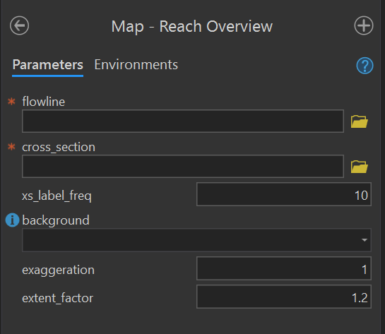
```

#### `Report - L1` {#L1-report-tool}
**Purpose** - This tool produces the [Level 1 Report](#L1-report) using these instructions from the [user manual](https://www.usermanual.fluvialgeomorph.org/level-1-workflow.html#run-report).  

**Code** - This ArcGIS script tool calls the R script [`FluvialGeomorph-toolbox/report/_Level_1_Report.R`](https://github.com/FluvialGeomorph/FluvialGeomorph-toolbox/blob/master/report/_Level_1_Report.R) which calls the R function [`fluvgeo::level_1_report`](https://github.com/FluvialGeomorph/fluvgeo/blob/master/R/level_1_report.R).

**Parameters** - This tool contains the following parameters: 
```{r, echo=FALSE}
params_table(params_df, "L1_report", "Reach Overview Map Tool Parameters.")
```

```{r echo=FALSE, fig.cap="Level 1 Report."}
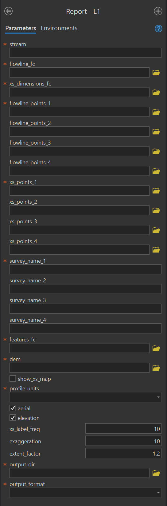
```


#### `Report - L2 Estimate Bankfull` {#estimate-bankfull-report-tool}
**Purpose** - This tool produces the [Estimate Bankfull Report](#estimate-bankfull-report) using these instructions from the [user manual](https://www.usermanual.fluvialgeomorph.org/level-2-workflow.html#estimate-bankfull). 

**Code** - This ArcGIS script tool calls the R script [`FluvialGeomorph-toolbox/report/_Estimate_Bankfull.R`](https://github.com/FluvialGeomorph/FluvialGeomorph-toolbox/blob/master/report/_Estimate_Bankfull.R). 

**Parameters** - This tool contains the following parameters: 
```{r, echo=FALSE}
params_table(params_df, "estimate_bankfull_report", "Estimate Bankfull Report Tool Parameters.")
```

```{r echo=FALSE, fig.cap="Estimate Bankfull Tool."}
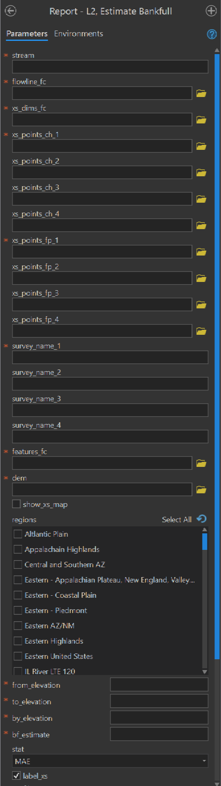
```

#### `Report - L2` {#L2-report-tool}
**Purpose** - This tool produces the [Level 2 Report](#L2-report) using these instructions from the [user manual](https://www.usermanual.fluvialgeomorph.org/level-2-workflow.html#run-report-1). 

**Code** - This ArcGIS script tool calls the R script [`FluvialGeomorph-toolbox/report/_Level_2_Report.R`](https://github.com/FluvialGeomorph/FluvialGeomorph-toolbox/blob/master/report/_Level_2_Report.R) which calls the R function [`fluvgeo::level_2_report`](https://github.com/FluvialGeomorph/fluvgeo/blob/master/R/level_2_report.R). 

**Parameters** - This tool contains the following parameters: 
```{r, echo=FALSE}
params_table(params_df, "L2_report", "Level 2 Report Tool Parameters.")
```

```{r echo=FALSE, fig.cap="Level 2 Report."}
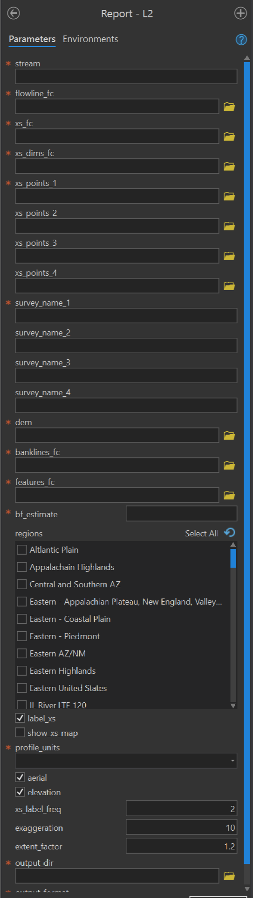
```


#### `Report - L3` {#L3-report-tool}
**Purpose** - This tool produces the [Level 3 Report](#L3-report) using these instructions in the [user manual](https://www.usermanual.fluvialgeomorph.org/level-3-workflow.html#run-report-2). 

**Code** - This ArcGIS script tool calls the R script [`FluvialGeomorph-toolbox/report/_Level_3_Report.R`](https://github.com/FluvialGeomorph/FluvialGeomorph-toolbox/blob/master/report/_Level_3_Report.R) which called the R function [`fluvgeo::level_3_report`](https://github.com/FluvialGeomorph/fluvgeo/blob/master/R/level_3_report.R). 

**Parameters** - This tool contains the following parameters: 
```{r, echo=FALSE}
params_table(params_df, "L3_report", "Level 3 Report Tool Parameters.")
```

```{r echo=FALSE, fig.cap="Level 3 Report."}
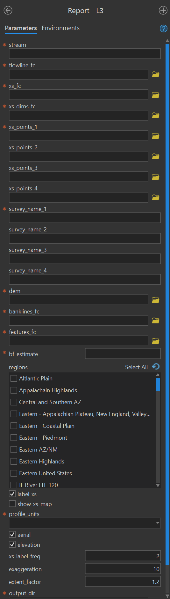
```


### 04 - Symbology toolset
The purpose of this toolset is to hold the tools that standardize the symbolization of FluvialGeomorph datasets. Given the complexity of the datasets involved in this analysis

#### `Banklines` {#banklines-symbol-tool}

#### `Contibuting Area` {#contributing-area-symbol-tool}

#### `Cross Section` {#cross-section-symbol-tool}

#### `DEM` {#dem-symbol-tool}

#### `Features` {#features-symbol-tool}

#### `Flowline` {#flowline-symbol-tool}

#### `Flowline Points` {#flowline-points-symbol-tool}

#### `Loop Points` {#loop-points-symbol-tool}

#### `Valleyline` {#valleyline-symbol-tool}


### 05 - Check toolset
The purpose of this toolset is to hold the tools used to check FluvialGeomorph features for errors. 

#### `Check ArcGIS Pro Compatibility`

#### `Check Bankline Points`

#### `Check Banklines`

#### `Check Cross Section Points`

#### `Check Cross Section`

#### `Check Features`

#### `Check Flowline`

#### `Check Flowline Points`

#### `Check Loop Points`

#### `Check Valleyline`

#### `Check valleyline Points`


### 06 - Export toolset
The purpose of this toolset is to export the tabular data from geospatial datasets for further analysis. 

#### `Level 1` {#L1-export-tool}

#### `Level 2` {#L2-export-tool}

#### `Level 3` {#L3-export-tool}


***

## Feature Classes
FluvialGeomorph defines a standard set of feature classes that are used through the tool chain. The definition of a common set of derived features is an important step in standardizing the FluvialGeomorph workflow. These database objects form a tightly linked set of features that work together in a particular order to accomplish the analysis. They are presented here in the approximate order in which they are produced. 

### Terrain Model Raster {#dem-raster}
The GIS analyst follows these instructions from the [user manual](https://www.usermanual.fluvialgeomorph.org/level-1-workflow.html#create-terrain) using standard ESRI geoprocessing tools to transform a LiDAR point cloud dataset covering the study area into an appropriately resolute (pixel cell size) digital elevation model (DEM). Only points representing the ground or water surface are selected from the point cloud to derive the terrain surface DEM. This raster dataset is named `dem`, but can also have a suffix added to represent its year of collection in change studies. Follow these instructions from 

```{r, echo=FALSE}
dd_table(dd_df, "dem", "DEM Raster Pixel Values.")
```

### Cutlines {#cutlines-fc}
The `cutlines` polyline feature class is created manually by the analyst using these instructions from the [user manual](https://www.usermanual.fluvialgeomorph.org/level-1-workflow.html#hydro-modify-dem). The `cutlines` polyline feature class is used to store geometry needed to hydrologically modify a terrain model to ensure that water can accurately flow over the land surface as it does in the real world. LiDAR derived terrain models frequently contain flow blockages (e.g., road berms) that must be "cut-through" to represent the presence of flow structures (e.g., culverts, bridges) that cannot be resolved directly from the LiDAR terrain model. 

```{r echo=FALSE}
dd_table(dd_df, "cutlines", "Cutlines Fields.")
```

### Hydro Modified Raster {#dem-hydro-raster}
Before the `dem` terrain model raster can be used for synthetically deriving stream features, it must first be hydrologically modified using the `cutlines` feature class to "burn" flow paths into the `dem` raster. The [`02 - Hydro DEM`](#hydro-dem-tool) tool creates a "hydro-enforced" DEM named `dem_hydro` using these instructions from the [user manual](https://www.usermanual.fluvialgeomorph.org/level-1-workflow.html#hydro-modify-dem). 

```{r, echo=FALSE}
dd_table(dd_df, "dem_hydro", "Hydro DEM Raster Pixel Values.")
```

### Contributing Area Raster {#contributing-area-raster}
The [`03 - Contributing Area`](#contributing-area-tool) tool uses the `dem_hydro` raster to create a `contributing_area` raster whose values store the drainage area upstream of each pixel using these instructions from the [user manual](https://www.usermanual.fluvialgeomorph.org/level-1-workflow.html#calculate-contributing-area). 

```{r, echo=FALSE}
dd_table(dd_df, "contributing_area", "Contributing Area Raster Pixel Values.")
```

### Flow Accumulation Raster {#flow-accumulation-raster}
The [`03a - Contributing Area D8`](#contributing-area-d8-tool) tool is used to calculate the `flow_accumulation_d8` raster whose values represent the number of upstream pixels using these instructions from the [user manual](https://www.usermanual.fluvialgeomorph.org/level-1-workflow.html#calculate-contributing-area).

```{r, echo=FALSE}
dd_table(dd_df, "flow_accummulation_d8", "Flow Accumulation D8 Raster Pixel Values.")
```

### Flow Direction Raster {#flow-direction-raster}
The [`03a - Contributing Area D8`](#contributing-area-d8-tool) tool is used to calculate the `flow_direction_d8` raster whose values represent the direction of flow across each pixel using these instructions from the [user manual](https://www.usermanual.fluvialgeomorph.org/level-1-workflow.html#calculate-contributing-area). 

```{r, echo=FALSE}
dd_table(dd_df, "flow_direction_d8", "Flow Direction D8 Raster Pixel Values.")
```

### Stream Network {#stream-network-fc}
The [`04 - Stream Network`](#stream-network-tool) tool uses the `contributing_area` raster to derive a synthetic `stream_network` polyline feature class representing the stream network of the study area using these instructions from the [user manual](https://www.usermanual.fluvialgeomorph.org/level-1-workflow.html#derive-stream-network). 

```{r, echo=FALSE}
dd_table(dd_df, "stream_network", "Stream Network Fields.")
```

### Stream Network Points {#stream-network-points-fc}
The [`04a - Stream Network Points`](#stream-network-points-tool) tool creates the  `stream_network_points` point feature class to represent regularly spaced points along a `stream_network` feature class using these instructions from the [user manual](https://www.usermanual.fluvialgeomorph.org/level-1-workflow.html#calculate-slope-and-sinuosity). These `stream_network_points` features are used to store elevation and route position (longitudinal stream stationing) information for a `stream_network` feature.  

```{r, echo=FALSE}
dd_table(dd_df, "stream_network_points", "Stream Network Points Fields.")
```

### Gradient {#gradient-fc}
The [`04b - Slope and Sinuosity`](#slope-sinuosity-tool) tool creates the `gradient_*` point feature class that calculates slope and sinuosity for a [`stream_network_points`](#stream-network-points) point feature class using these instructions in the [user manual](https://www.usermanual.fluvialgeomorph.org/level-1-workflow.html#calculate-slope-and-sinuosity). The `gradient_*` point feature class is named using the moving window size specified.   

```{r, echo=FALSE}
dd_table(dd_df, "gradient", "Gradient Points Fields.")
```

### Watershed Points {#watershed-points-fc}
The `watershed_points` feature class is manually created by the analyst using the `stream_network_points` feature class following these instructions from the [user manual](https://www.usermanual.fluvialgeomorph.org/level-1-workflow.html#delineate-watersheds). The `watershed_points` point feature class is used to represent the downstream location of watersheds whose areal extent is to be calculated. These single points are sometimes referred to as "pour points" located along a stream network. 

```{r, echo=FALSE}
dd_table(dd_df, "watershed_points", "Watershed Points Fields.")
```

### Watershed {#watershed-fc}
The [04c - Watershed](#watershed-tool) tool creates the `watershed` polygon feature class and represent the drainage area upstream of a single point (aka "pour point") located along a stream network. All pixels within each `watershed` polygon feature flow to the stream network point used to derive the watershed using these instructions from the [user manual](https://www.usermanual.fluvialgeomorph.org/level-1-workflow.html#define-stream-reaches). 

```{r, echo=FALSE}
dd_table(dd_df, "watershed", "Watershed Fields.")
```

### Flowline {#flowline-fc}
The [`05 - Flowline`](#05---fowline) tool creates the `flowline` polyline feature class and is used to represent the likely flow path of a stream reach within a study area using these instructions from the [user manual](https://www.usermanual.fluvialgeomorph.org/level-1-workflow.html#derive-flowline). This is the primary flow path feature used in the FluvialGeomorph toolbox. Since non-bathymetric LiDAR is often used to derive `flowline` features, this should not be interpreted as the thalweg when water is present in the DEM.  

```{r, echo=FALSE}
dd_table(dd_df, "flowline", "Flowline Fields.")
```

### Flowline Points {#flowline-points-fc}
The [`06 - Flowline Points`](#flowline-points-tool) tool creates the `flowline_points` point feature class and is used to represent regularly spaced points along a `flowline` feature class using these instructions from the [user manual](https://www.usermanual.fluvialgeomorph.org/level-1-workflow.html#create-flowline-points). These `flowline_points` features are used to store elevation and route position (longitudinal stream stationing) information for a `flowline` feature. `flowline_points` are used to calculate a series of stream longitudinal dimensions. 

```{r, echo=FALSE}
dd_table(dd_df, "flowline_points", "Flowline Points Fields.")
```

### Detrended Raster {#detrend-raster}
The [`07 - Detrend DEM`](#detrend-dem-tool) tool creates the `detrend` raster dataset using these instruction from the [user manual](https://www.usermanual.fluvialgeomorph.org/level-1-workflow.html#detrend-dem). The `detrend` raster is an elevation model where the downstream slope of the `dem_hydro` has been removed. 

```{r, echo=FALSE}
dd_table(dd_df, "detrend", "Hydro DEM Raster Pixel Values.")
```

### Channel Slope Raster {#channel-slope-raster}
The [`09 - Channel Slope`](#channel-slope-tool) tool creates the `channel_slope` raster using these instructions from the [user manual](https://www.usermanual.fluvialgeomorph.org/level-1-workflow.html#calculate-channel-slope-raster). The `channel_slope` raster represents the slope of the `dem_hydro` within the channel. This is not to be confused with the longitudinal slope of the stream reach, but is the pixel-wise, raster surface slope of the channel area. 

```{r, echo=FALSE}
dd_table(dd_df, "channel_slope", "Channel Slope Raster Pixel Values.")
```

### Centerline {#centerline-fc}
The [`10 - Centerline`](#centerline-tool) tool creates the `centerline` polyline feature class using these instructions from the [user manual](). The `centerline` polyline feature class is used to represent a stream flow path that falls roughly equidistant between the banklines at bankfull water surface elevation. 

```{r, echo=FALSE}
dd_table(dd_df, "centerline", "Centerline Fields.")
```

### Regular Cross Sections {#regular-xs-fc}
The [`11 - XS Layout`](#xs-layout-tool) tool is used to create a regularly spaced cross section `xs_*` polyline feature class using these instructions from the [user manual](https://www.usermanual.fluvialgeomorph.org/level-1-workflow.html#create-regular-cross-section-geometry). Cross sections are polyline feature classes drawn perpendicular to the `flowline` feature and are long enough to extend across some portion of the channel and floodplain. Cross section features are used to define channel cross section dimensions. Regular cross sections are spaced equal distances longitudinally along the `flowline`. Regularly spaced cross sections are used to sample conditions within a stream reach to display a continuous series of values and calculate aggregate stream values. 

```{r, echo=FALSE}
dd_table(dd_df, "xs", "Regular Cross Section Fields.")
```

### Riffle Cross Sections {#riffle-xs-fc}
Riffle cross sections (i.e., `riffle_floodplain`, `riffle_channel`) are a unique type of cross section manually drawn by the analyst within a riffle stream feature using these instructions from the [user manual](https://www.usermanual.fluvialgeomorph.org/level-2-workflow.html#create-initial-riffle-geometry). In contrast to regularly spaced cross sections that are delineated by a script, riffles irregularly spaced along a stream and are manually drawn by a GIS analyst. Analysts are trained to identify riffles using a set of guidelines from the literature and interpretation of the DEM and aerial imagery. The `riffle_floodplain` polyline feature class is drawn longitudinally within riffle features and extend laterally across the active floodplain. The `riffle_channel` polyline feature class is also drawn longitudinally within riffle features, but only extend laterally across the bankfull channel area. 

```{r, echo=FALSE}
dd_table(dd_df, "riffle_floodplain", "Riffle Floodplain Riffle Channel Cross Section Fields.")
```

### Cross Section Points {#xs-points-fc}
The [`14 - XS Points`](#xs-points-tool) tool creates the `*_points` points feature class using these instructions from the user manual for [Level 1](https://www.usermanual.fluvialgeomorph.org/level-1-workflow.html#calculate-cross-section-points) and [Level 2](https://www.usermanual.fluvialgeomorph.org/level-2-workflow.html#calculate-cross-section-points-1). Cross sections polyline feature classes (i.e., regularly spaced cross sections and riffle cross sections: `riffle_floodplain`, `riffle_channel`) can be converted to a set of regularly spaced points along the cross section. These points are used to store elevation and route position (lateral stream stationing) information for a cross section feature class. Cross section points are used to calculate a series of cross section dimensions. 

```{r, echo=FALSE}
dd_table(dd_df, "xs_points", "Cross Section Points Fields.")
```

### Cross Section Dimensions {#xs-dimensions-fc}
Cross section dimension polyline feature classes are used to store the hydraulic dimensions calculated for each cross section. Since the FluvialGeomorph workflow is divided into three levels, cross section dimensions are calculated at each level. Each level allows for an increasingly complex set of dimensions to be calculated, with each level building on the complexity of the previous level.  There are three cross section dimension feature classes, one for each level `*_dims_L1`, `*_dims_L2`, and `*_dims_L3`. Cross section dimensions are calculated using the following tools:

* **Level 1 Dimensions** - The [`15a XS Dimensions, Level 1`](#xs-dimensions-L1-tool) tool creates the `*_dims_L1` feature class using these instructions from the [user manual](https://www.usermanual.fluvialgeomorph.org/level-1-workflow.html#calculate-cross-section-l1-dimensions). 
* **Level 2 Dimensions** - The [`15b XS Dimensions, Level 2`](#xs-dimensions-L2-tool) tool creates the `*_dims_L2` feature class using these instructions from the user manual for [L2 Initial](https://www.usermanual.fluvialgeomorph.org/level-2-workflow.html#calculate-initial-cross-section-l2-dimension) and [L2 Final](https://www.usermanual.fluvialgeomorph.org/level-2-workflow.html#calculate-final-l2-cross-section-geometry). 
* **Level 3 Dimensions** - The [`15c XS Planform, Level 3`](#xs-dimensions-L3-tool) tool creates the `*_dims_L3` feature class using these instructions from the [user manual](https://www.usermanual.fluvialgeomorph.org/level-3-workflow.html#calculate-l3-cross-section-geometry). 

Cross section dimensions can be calculated for the various types of cross sections (regular cross sections or riffle cross sections). The name of the cross section feature for which dimensions were calculated is prepended to the output dimension feature class. Metrics calculated at previous levels are included in the attribute table of each dimension feature class. Therefore, to avoid repetition only the new fields calculated at each level are included in the tables of fields in this section. The attributes of the original cross section feature class are also omitted since they depend on the cross section type used. 

```{r, echo=FALSE}
dd_table(dd_df, "_dims_L1", "Level 1 Cross Section Dimension Fields.")
```

```{r, echo=FALSE}
dd_table(dd_df, "_dims_L2", "Level 2 Cross Section Dimension Fields.")
```

```{r, echo=FALSE}
dd_table(dd_df, "_dims_L3", "Level 3 Cross Section Dimension Fields.")
```

### Bankfull Area {#bankfull-area-fc}
The [`08 - Water Surface Extent`](#water-surface-extent-tool) tool is used to create the `bankfull_area` polygon feature class using these instructions from the [user manual](https://www.usermanual.fluvialgeomorph.org/level-2-workflow.html#create-bankfull-area). The `bankfull_area` polygon feature class represents the channel area typically inundated during bankfull events. The `detrend` raster dataset is used to interactively "flood" the channel to define this extent. 

```{r, echo=FALSE}
dd_table(dd_df, "bankfull_area", "Bankfull Area Fields.")
```

### Banklines {#banklines-fc}
The `banklines` feature class is manually created from the `bankfull_area` using these instructions from the [user manual](https://www.usermanual.fluvialgeomorph.org/level-2-workflow.html#create-banklines). The `banklines` polyline feature class represents the stream banks at bankfull. The edge of the `bankfull_area` polygon features are used to create to banklines, one representing the left descending bank and another the right descending bank. 

```{r, echo=FALSE}
dd_table(dd_df, "banklines", "Banklines Fields.")
```

### Bankline Points {#bankline-points-fc}
The [`14b - Bankline Points`](#bankline-points-tool) tool creates the `bankline_points` point feature class using these instructions in the [user manual](https://www.usermanual.fluvialgeomorph.org/level-3-workflow.html#derive-bankline-points). The `bankline_points` point feature class is a set of regularly spaced point features located along each `banklines` feature. These points are used to store elevation and route position (longitudinal bankline stationing) information for each bankline. 

```{r, echo=FALSE}
dd_table(dd_df, "bankline_points", "Bankline Points Fields.")
```

### Valleyline {#valleyline-fc}
The `valleyline` is created using these instructions from the [user manual](https://www.usermanual.fluvialgeomorph.org/level-3-workflow.html#define-valley-line). The `valleyline` polyline feature class represents the trend line of the down-valley axis. It bisects stream meanders as the stream swings from side to side across its floodplain. 

```{r, echo=FALSE}
dd_table(dd_df, "valleyline", "Valleyline Fields.")
```

### Loop Points {#loop-points-fc}
The `loop_points` point feature class is manually created by the analyst using these instructions from the [user manual](https://www.usermanual.fluvialgeomorph.org/level-3-workflow.html#define-meander-loops). The `loop_points` point feature class is used to store the longitudinal extents of loops and bends used for planform analysis. Within the FluvialGeomorph toolbox, the term "loop" is defined as a single meander as it swings across the `valleyline`. Moving downstream along a single loop, once the stream swings substantially across the valleyline, another loop begins. The point of maximum distance of a flowline from the valeyline (laterally across the floodplain) defines a loop "apex". Moving to a finer scale, "bends" are defined as stream undulations within a particular loop. Therefore, a single loop may contain many bends. These loop and bend extents and loop apices are used to calculate a set of planform dimensions. 

```{r, echo=FALSE}
dd_table(dd_df, "loop_points", "Loop Points Fields.")
```

### Features {#features-fc}
The `features` point feature class is created manually by the analyst using these instructions in the [user manual](https://www.usermanual.fluvialgeomorph.org/level-1-workflow.html#identify-infrastructure). The `features` point feature class is used to identify and label key stream features and their longitudinal position. Instances of features typically include relevant tributaries, localities, and infrastructure built within the floodplain affecting flow. 

```{r, echo=FALSE}
dd_table(dd_df, "features", "Features Fields.")
```

***

## Reports
FluvialGeomorph produces a series of reports that help to define stream conditions. 

### `Graph - Longitudinal Profile Compare` {#longitudinal-profile-compare-graph}
This graph is produced using the [`Graph - Longitudinal Profile Compare`](#longitudinal-profile-compare-graph-tool) tool. 

```{r echo=FALSE, fig.cap="Longitudinal Profile Plot.", out.width="100%"}
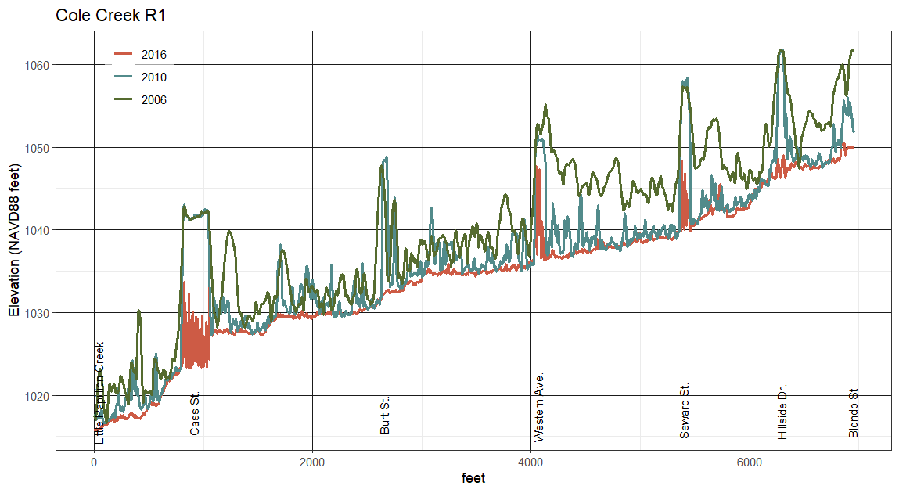
```

***

### `Report - L1` {#L1-report}
**Purpose** - The Level 1 Report contains a set of maps and graphs that describe the channel as measured from the LiDAR derived DEM. This report is produced using the [`Report - L1`](#L1-report-tool) tool using these instructions from the [user manual](https://www.usermanual.fluvialgeomorph.org/level-1-workflow.html#run-report). 

**Code** - This report is created by the [R Markdown parameterized report](https://bookdown.org/yihui/rmarkdown/parameterized-reports.html) in the R package [`fluvgeo/reports/level_1_report.Rmd`](https://github.com/FluvialGeomorph/fluvgeo/blob/master/inst/reports/level_1_report.Rmd). 

This report contains the following sections:   

* **Study Area Overview** - This section provides an overview of the study area reach.    
  * Reach Overview Map - A reach overview map displaying cross section locations over an aerial image and/or a medium resolution DEM with multi-direction shaded relief. This figure is produced by the R function [`fluvgeo::map_reach_overview`](https://github.com/FluvialGeomorph/fluvgeo/blob/master/R/map_reach_overview.R).  
  
* **Longitudinal Profile** - This section displays the elevation (y-axis) of the stream reach along its length (x-axis) beginning from the downstream end of the reach moving upstream (typically referred to as a longitudinal profile).   
  * Longitudinal Profile - This longitudinal profile graph is created from the [`flowline_points`](#flowline-points-fc) feature class for several surveys if available.  This figure is produced by the R function [`fluvgeo::compare_long_profile.R`](https://github.com/FluvialGeomorph/fluvgeo/blob/master/R/compare_long_profile.R).   
  * XS Longitudinal Profile - This longitudinal profile graph is created using a [regular cross sections](#regular-xs-fc) feature class. This figure is produced by the R function [`fluvgeo::compare_xs_long_profile`](https://github.com/FluvialGeomorph/fluvgeo/blob/master/R/compare_xs_long_profile.R).   

* **Cross Section Metrics** - This section displays metrics for the cross sections of a stream reach.  
  * Cross Section Metrics Plot, Level 1 - This stream reach metrics graph displays the Level 1 metrics on a faceted graph. This figure is produced by the R function [`fluvgeo::xs_metrics_plot_L1`](https://github.com/FluvialGeomorph/fluvgeo/blob/master/R/xs_metrics_plot_L1.R). 
  
* **Cross Section Profiles** - This section displays a focused view of the characteristics of each individual cross section in the stream reach. 
  * Cross Section Map - This map displays the extent of a single cross section in plan view with a DEM background. This figure is produced by the R function [`fluvgeo::map_xs`](https://github.com/FluvialGeomorph/fluvgeo/blob/master/R/map_xs.R).
  * Cross Section Profile Compare Plot - This graph displays a single regularly spaced cross section in profile view comparing the elevations from multiple surveys if provided. This figure is produced by the R function [`fluvgeo::xs_compare_plot_L1`](https://github.com/FluvialGeomorph/fluvgeo/blob/master/R/xs_compare_plot_L1.R).

```{r echo=FALSE, fig.cap="Level 1 Report.", out.width="100%"}
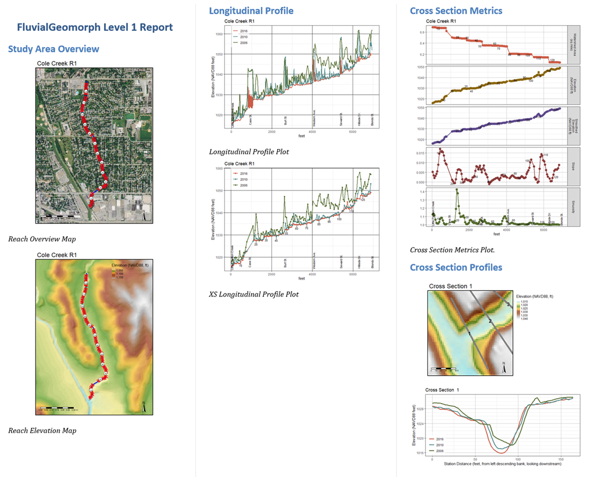
```

***

### `Report - L2 Estimate Bankfull` {#estimate-bankfull-report}
**Purpose** - The Estimate Bankfull Report is used to help estimate the bankfull water surface elevation for an ungaged stream with the assistance of regional curves and visual observation of geomorphic indicators from LiDAR surveys. This report is produced using the [`Report - L2 Estimate Bankfull`](#estimate-bankfull-report-tool) tool using these instructions from the [user manual](https://www.usermanual.fluvialgeomorph.org/level-2-workflow.html#estimate-bankfull). 

**Code** - This report is created by the [R Markdown parameterized report](https://bookdown.org/yihui/rmarkdown/parameterized-reports.html) in the R package [`fluvgeo/reports/estimate_bankfull_report.Rmd`](https://github.com/FluvialGeomorph/fluvgeo/blob/master/inst/reports/estimate_bankfull_report.Rmd).

This report contains the follow sections:

* **Study Area Overview** - This section provides an overview of the study area reach.    
  * Reach Overview Map - A reach overview map displaying cross section locations over an aerial image and/or a medium resolution DEM with multi-direction shaded relief. This figure is produced by the R function [`fluvgeo::map_reach_overview`](https://github.com/FluvialGeomorph/fluvgeo/blob/master/R/map_reach_overview.R).  

* **Bankfull Elevation Sensitivity Analysis** - This section performs a sensitivity analysis of the directly measured reach-wide channel dimensions compared to the regional curve estimated channel dimensions. 
  * Bankfull Elevation Goodness of Fit Graph - This graph is used to identify how similar this reach's dimensions are compared to dimensions from several other regions at the current bankfull estimate. This figure is produced by the R function [`fluvgeo::gof_graph`](https://github.com/FluvialGeomorph/fluvgeo/blob/master/R/gof_graph.R). 
  * Bankfull Elevation Dimensions by Region Table - This table summarizes this reach's dimensions compared to several other regions at the current bankfull elevation. This table is created by code in the Estimate Bankfull Report, [`fluvgeo/reports/estimate_bankfull_report.Rmd`](https://github.com/FluvialGeomorph/fluvgeo/blob/master/inst/reports/estimate_bankfull_report.Rmd)
  * Regional Hydraulic Geometry Curves Graph - This graph displays the channel dimensions of each cross section in the reach, along with the regional curve estimated dimensions. This figure is produced by the R function [`fluvgeo::reach_rhg_graph`](https://github.com/FluvialGeomorph/fluvgeo/blob/master/R/reach_rhg_graph.R). 

* **Longitudinal Profile** - This section displays the elevation (y-axis) of the stream reach along its length (x-axis) beginning from the downstream end of the reach moving upstream (typically referred to as a longitudinal profile).   
  * XS Longitudinal Profile - This longitudinal profile graph is created using a [`riffle_channel`](#riffle-xs-fc) feature class for the survey used to generate the bankfull estimate. This figure is produced by the R function [`fluvgeo::xs_profile_plot`](https://github.com/FluvialGeomorph/fluvgeo/blob/master/R/xs_profile_plot.R).   

* **Cross Section Metrics** - This section displays metrics the Level 2 metrics for the riffle cross sections of a stream reach.  
  * Cross Section Metrics Plot, Level 2 - This stream reach metrics graph displays the Level 2 metrics on a faceted graph. This figure is produced by the R function [`fluvgeo::xs_metrics_plot_L2`](https://github.com/FluvialGeomorph/fluvgeo/blob/master/R/xs_metrics_plot_L2.R). 
  
* **Cross Section Profiles** - This section displays a focused view of the characteristics of each individual cross section in the stream reach. 
  * Cross Section Map - This map displays the extent of a single cross section in plan view with a high resolution DEM background. This figure is produced by the R function [`fluvgeo::map_xs`](https://github.com/FluvialGeomorph/fluvgeo/blob/master/R/map_xs.R).
  * Floodplain XS Profile Compare Plot - This graph displays a single `riffle_floodplain` feature in a wide aspect ratio profile view to compare the elevations from multiple surveys if provided. This figure is produced by the R function [`fluvgeo::xs_compare_plot_L2`](https://github.com/FluvialGeomorph/fluvgeo/blob/master/R/xs_compare_plot_L2.R).
  * Channel XS Profile Compare Plot - This graph displays a single `riffle_channel` feature in a square aspect ratio profile view to compare the elevations from multiple surveys if provided. This figure is produced by the R function [`fluvgeo::xs_compare_plot_L2`](https://github.com/FluvialGeomorph/fluvgeo/blob/master/R/xs_compare_plot_L2.R).
  * Bankfull Elevation Dimensions by Region Table - This table summarizes this cross section's dimensions compared to several other regions at the current bankfull elevation. This table is created by code in the Estimate Bankfull Report, [`fluvgeo/reports/estimate_bankfull_report.Rmd`](https://github.com/FluvialGeomorph/fluvgeo/blob/master/inst/reports/estimate_bankfull_report.Rmd). 

```{r echo=FALSE, fig.cap="Level 2, Estimate Bankfull Report.", out.width="100%"}
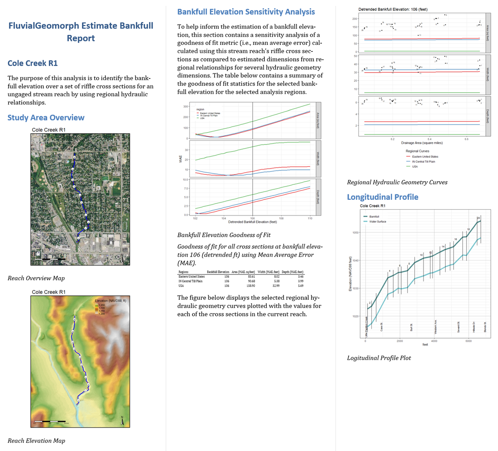
```

***

### `Report - L2` {#L2-report}
**Purpose** - The Level 2 Report contains a set of maps and graphs that describe the Level 2 channel dimensions calculated at the specified bankfull elevation, estimated using the [L2 Estimate Bankfull Report](#estimate-bankfull-report). This report is produced using the [`Report - L2`](#L2-report-tool) tool using these instructions from the [user manual](https://www.usermanual.fluvialgeomorph.org/level-2-workflow.html#run-report-1). 

**Code** - This report is created by the [R Markdown parameterized report](https://bookdown.org/yihui/rmarkdown/parameterized-reports.html) in the R package [`fluvgeo/reports/level_2_report.Rmd`](https://github.com/FluvialGeomorph/fluvgeo/blob/master/inst/reports/level_2_report.Rmd). 

This report contains the following sections:

* **Study Area Overview** - This section provides an overview of the study area reach.    
  * Reach Overview Map - A reach overview map displaying cross section locations over an aerial image and/or a medium resolution DEM with multi-direction shaded relief. This figure is produced by the R function [`fluvgeo::map_reach_overview`](https://github.com/FluvialGeomorph/fluvgeo/blob/master/R/map_reach_overview.R).  

* **Longitudinal Profile** - This section displays the elevation (y-axis) of the stream reach along its length (x-axis) beginning from the downstream end of the reach moving upstream (typically referred to as a longitudinal profile).   
  * XS Longitudinal Profile - This longitudinal profile graph is created using a [Level 2 cross section dimensions](#xs-dimensions-fc) feature class for the survey used to generate the bankfull estimate. This figure is produced by the R function [`fluvgeo::xs_profile_plot`](https://github.com/FluvialGeomorph/fluvgeo/blob/master/R/xs_profile_plot.R).   

* **Cross Section Metrics** - This section displays metrics for the Level 2 dimensions calculated for the regular cross sections of a stream reach.  
  * Cross Section Metrics Plot, Level 2 - This stream reach metrics graph displays the Level 2 metrics on a faceted graph. This figure is produced by the R function [`fluvgeo::xs_metrics_plot_L2`](https://github.com/FluvialGeomorph/fluvgeo/blob/master/R/xs_metrics_plot_L2.R). 
  * Width Depth Ratio Map - A reach overview map is used to display the width depth ratio values at each cross section for the reach. The width depth ratio parameters (i.e., metric definition, class break values and labels) are defined in this report using the R S4 class [`FluvialGeomorphicMetric`](https://github.com/FluvialGeomorph/fluvgeo/blob/master/R/FluvialGeomorphicMetric.R). This figure is produced by the R function [`fluvgeo::map_reach_metric`](https://github.com/FluvialGeomorph/fluvgeo/blob/master/R/map_reach_metric.R). 
  * Width Depth Ratio Graph - This graph displays the width depth ratio values (y-axis) of the stream along its length (x-axis) beginning from the downstream end of the reach moving upstream longitudinally. This graph uses the metric class definition for width depth ratio defined for the previous figure. This figure is produced by the R function [`fluvgeo::xs_metric_plot`](https://github.com/FluvialGeomorph/fluvgeo/blob/master/R/xs_metric_plot.R). 
  * Regional Hydraulic Geometry Curves Graph - This graph displays the channel dimensions of each cross section in the reach, along with the regional curve estimated dimensions. This figure is produced by the R function [`fluvgeo::reach_rhg_graph`](https://github.com/FluvialGeomorph/fluvgeo/blob/master/R/reach_rhg_graph.R). 

* **Cross Section Profiles** - This section displays a focused view of the characteristics of each individual cross section in the stream reach. 
  * Cross Section Map - This map displays the extent of a single cross section in plan view with a high resolution DEM background. This figure is produced by the R function [`fluvgeo::map_xs`](https://github.com/FluvialGeomorph/fluvgeo/blob/master/R/map_xs.R).
  * Regular XS Profile Compare Plot - This graph displays a single `*_L2_dims` feature in a wide aspect ratio profile view to compare the elevations from multiple surveys if provided. This figure is produced by the R function [`fluvgeo::xs_compare_plot_L2`](https://github.com/FluvialGeomorph/fluvgeo/blob/master/R/xs_compare_plot_L2.R).
  * Bankfull Elevation Dimensions by Region Table - This table summarizes this cross section's dimensions compared to several other regions at the current bankfull elevation. This table is created by code in the L2 Report, [`fluvgeo/reports/level_2_report.Rmd`](https://github.com/FluvialGeomorph/fluvgeo/blob/master/inst/reports/level_2_report.Rmd). 

```{r echo=FALSE, fig.cap="Level 2 Report.", out.width="100%"}
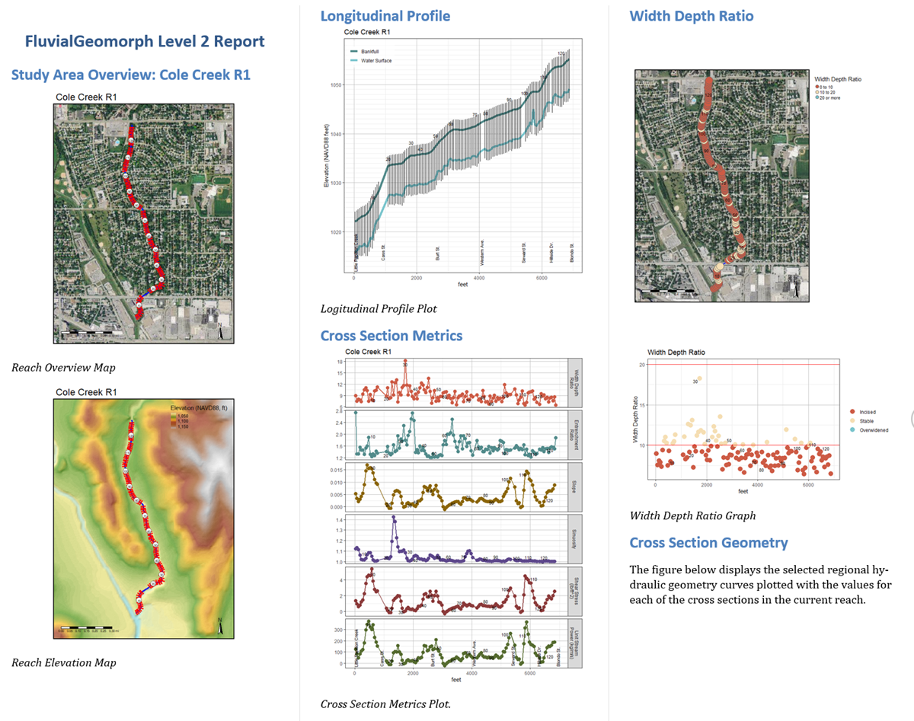
```

***

### `Report - L3` {#L3-report}
**Purpose** - The Level 3 Report contains a set of maps and graphs that describe the Level 3 channel dimensions calculated at the specified bankfull elevation, estimated using the [L2 Estimate Bankfull Report](#estimate-bankfull-report). This report is produced using the [`Report - L3`](#L3-report-tool) tool using these instructions from the [user manual](https://www.usermanual.fluvialgeomorph.org/level-3-workflow.html#run-report-2). 

**Code** - This report is created by the [R Markdown parameterized report](https://bookdown.org/yihui/rmarkdown/parameterized-reports.html) in the R package [`fluvgeo/reports/level_3_report.Rmd`](https://github.com/FluvialGeomorph/fluvgeo/blob/master/inst/reports/level_3_report.Rmd). 

This report contains the following sections:

* **Study Area Overview** - This section provides an overview of the study area reach.    
  * Reach Overview Map - A reach overview map displaying cross section locations over an aerial image and/or a medium resolution DEM with multi-direction shaded relief. This figure is produced by the R function [`fluvgeo::map_reach_overview`](https://github.com/FluvialGeomorph/fluvgeo/blob/master/R/map_reach_overview.R).  

* **Longitudinal Profile** - This section displays the elevation (y-axis) of the stream reach along its length (x-axis) beginning from the downstream end of the reach moving upstream (typically referred to as a longitudinal profile).   
  * XS Longitudinal Profile - This longitudinal profile graph is created using a [Level 3 cross section dimensions](#xs-dimensions-fc) feature class for the survey used to generate the bankfull estimate. This figure is produced by the R function [`fluvgeo::xs_profile_plot`](https://github.com/FluvialGeomorph/fluvgeo/blob/master/R/xs_profile_plot.R).   

* **Cross Section Metrics** - This section displays metrics for the Level 3 dimensions calculated for the regular cross sections of a stream reach.  
  * Cross Section Metrics Plot, Level 3 - This stream reach metrics graph displays the Level 3 metrics on a faceted graph. This figure is produced by the R function [`fluvgeo::xs_metrics_plot_L3`](https://github.com/FluvialGeomorph/fluvgeo/blob/master/R/xs_metrics_plot_L3.R). 
  * Width Depth Ratio Map - A reach overview map is used to display the width depth ratio values at each cross section for the reach. The width depth ratio parameters (i.e., metric definition, class break values and labels) are defined in this report using the R S4 class [`FluvialGeomorphicMetric`](https://github.com/FluvialGeomorph/fluvgeo/blob/master/R/FluvialGeomorphicMetric.R). This figure is produced by the R function [`fluvgeo::map_reach_metric`](https://github.com/FluvialGeomorph/fluvgeo/blob/master/R/map_reach_metric.R). 
  * Width Depth Ratio Graph - This graph displays the width depth ratio values (y-axis) of the stream along its length (x-axis) beginning from the downstream end of the reach moving upstream longitudinally. This graph uses the metric class definition for width depth ratio defined for the previous figure. This figure is produced by the R function [`fluvgeo::xs_metric_plot`](https://github.com/FluvialGeomorph/fluvgeo/blob/master/R/xs_metric_plot.R). 
  * Radius of Curvature to Bankfull Width Map - A reach overview map is used to display the radius of curvature to bankfull width ratio values at each cross section for the reach. The radius of curvature to bankfull width ratio parameters (i.e., metric definition, class break values and labels) are defined in this report using the R S4 class [`FluvialGeomorphicMetric`](https://github.com/FluvialGeomorph/fluvgeo/blob/master/R/FluvialGeomorphicMetric.R). This figure is produced by the R function [`fluvgeo::map_reach_metric`](https://github.com/FluvialGeomorph/fluvgeo/blob/master/R/map_reach_metric.R). 
  * Radius of Curvature to Bankfull Width Graph - This graph displays the radius of curvature to bankfull width ratio values (y-axis) of the stream along its length (x-axis) beginning from the downstream end of the reach moving upstream longitudinally. This graph uses the metric class definition for radius of curvature to bankfull width ratio defined for the previous figure. This figure is produced by the R function [`fluvgeo::xs_metric_plot`](https://github.com/FluvialGeomorph/fluvgeo/blob/master/R/xs_metric_plot.R). 
  * Regional Hydraulic Geometry Curves Graph - This graph displays the channel dimensions of each cross section in the reach, along with the regional curve estimated dimensions. This figure is produced by the R function [`fluvgeo::reach_rhg_graph`](https://github.com/FluvialGeomorph/fluvgeo/blob/master/R/reach_rhg_graph.R). 

* **Cross Section Profiles** - This section displays a focused view of the characteristics of each individual cross section in the stream reach. 
  * Cross Section Map - This map displays the extent of a single cross section in plan view with a high resolution DEM background. This figure is produced by the R function [`fluvgeo::map_xs`](https://github.com/FluvialGeomorph/fluvgeo/blob/master/R/map_xs.R).
  * Regular XS Profile Compare Plot - This graph displays a single `*_L3_dims` feature in a wide aspect ratio profile view to compare the elevations from multiple surveys if provided. This figure is produced by the R function [`fluvgeo::xs_compare_plot_L2`](https://github.com/FluvialGeomorph/fluvgeo/blob/master/R/xs_compare_plot_L2.R).
  * Bankfull Elevation Dimensions by Region Table - This table summarizes this cross section's dimensions compared to several other regions at the current bankfull elevation. This table is created by code in the L3 Report, [`fluvgeo/reports/level_3_report.Rmd`](https://github.com/FluvialGeomorph/fluvgeo/blob/master/inst/reports/level_3_report.Rmd). 
  
```{r echo=FALSE, fig.cap="Level 3 Report.", out.width="100%"}
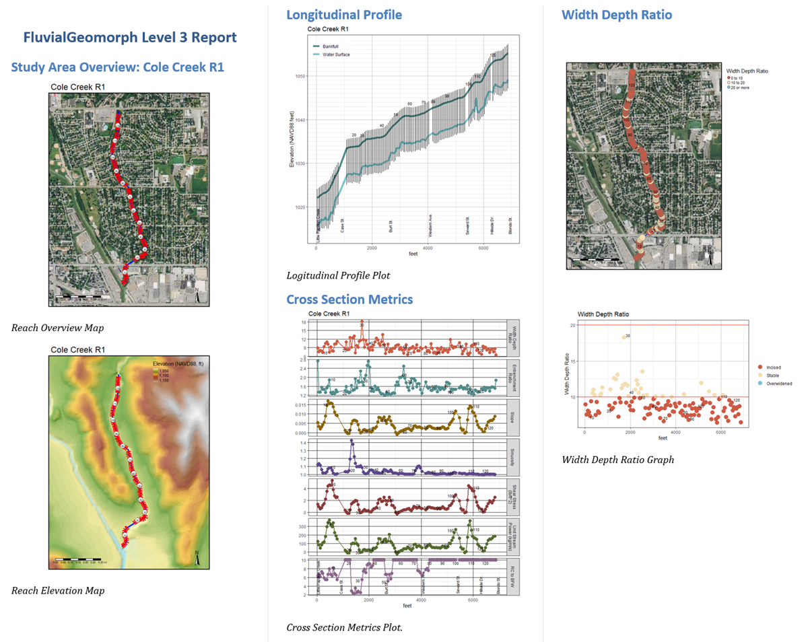
```


***
