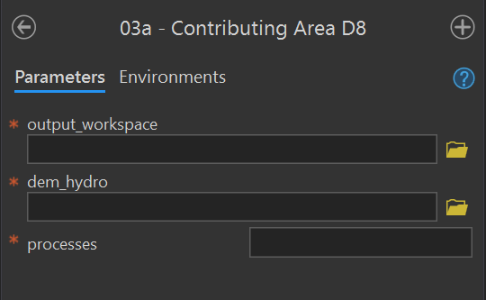
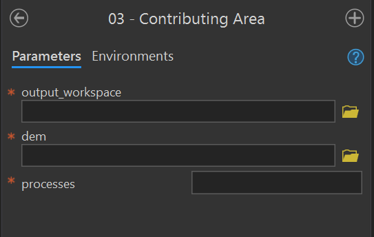
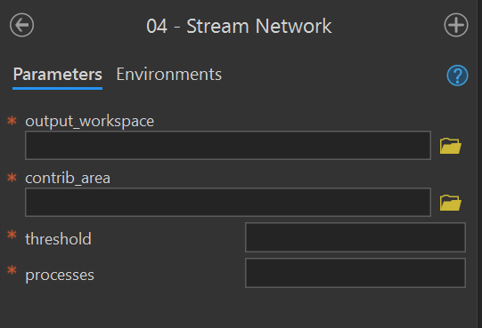
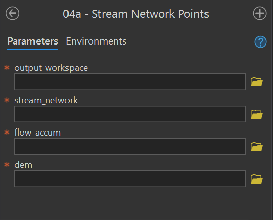
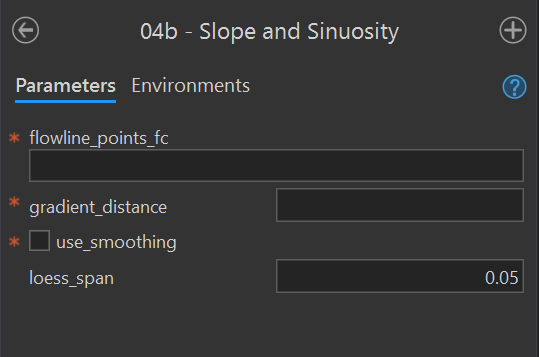
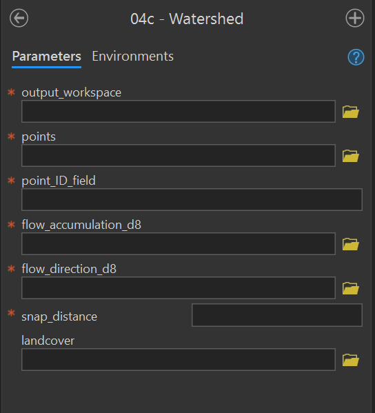
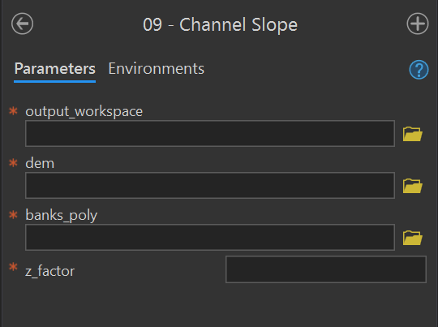
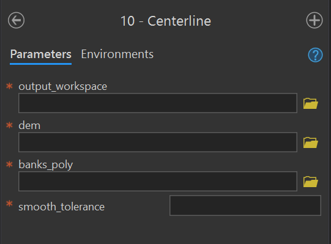
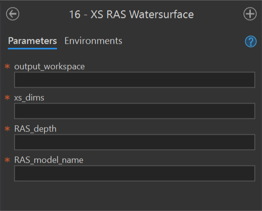

```{r library, include=FALSE}
library(knitr)
library(png)
library(dplyr)
library(magrittr)
```

```{r import, include=FALSE}
params_df <- read.csv("parameters.csv")
```


```{r table_functions, include=FALSE}
#' @title Creates a table of parameters for a tool.
#'
#' @param params_df       data frame; A data frame of parameters. Must have the
#'                        columns: tool, parameter_name, data_type, description, #'                        required. 
#' @param tool            character; The name of the tool whose parameters will
#'                        be displayed. 
#' @param caption         character; The text of the table caption for the 
#'                        output table. 
#'
#' @return A knitr::kable containing records for each of the parameters for the 
#' specified tool. Table includes parameter_name, data_type, description, 
#' required. 
#'
params_table <- function(params_df, tool, caption) {
  param_names <- c("Parameter", "Type", "Description", "Required")
  tool_dd <- filter(params_df, tool == !!tool) %>%
             select(parameter_name:required)
  kable(tool_dd, col.names = param_names,
        caption = caption)

}
```


#### `03a - Contributing Area D8` {#contributing-area-d8-tool}
**Purpose** - This tool creates the D8 [`flow_accumulation_d8`](#flow-accumulation-raster) and [`flow_direction_d8`](#flow-direction-raster) rasters in the output workspace for a given input DEM using these instructions in the [user manual](https://fluvialgeomorph.github.io/FG-User-Manual/level-1-workflow.html#calculate-contributing-area).  

**Code** - This ArcGIS script tool calls the Python script [`FluvialGeomorph-toolbox/tools/_03a_ContributingAreaD8.py`](https://github.com/FluvialGeomorph/FluvialGeomorph-toolbox/blob/master/tools/_03a_ContributingAreaD8.py). 

**Parameters** - This tool contains the following parameters:
```{r, echo=FALSE}
params_table(params_df, "contributing_area_D8", "Contributing Area D8 Tool Parameters.")
```

```{r echo=FALSE, fig.cap="03a - Contributing Area D8 Tool."}

```

***


#### `03 - Contributing Area` {#contributing-area-tool}
**Purpose** - This tool calculates the [D-infinity contributing area](https://hydrology.usu.edu/taudem/taudem5/help53/DInfinityContributingArea.html) for each pixel in the input DEM and creates a [`contributing_area`](#contributing-area-raster) raster in the output workspace using these instructions in the [user manual](https://fluvialgeomorph.github.io/FG-User-Manual/level-1-workflow.html#calculate-contributing-area). 

**Code** - This ArcGIS script tool calls the Python script [`FluvialGeomorph-toolbox/tools/_03_ContributingArea.py`](https://github.com/FluvialGeomorph/FluvialGeomorph-toolbox/blob/master/tools/_03_ContributingArea.py). This Python script uses the [TauDEM](https://hydrology.usu.edu/taudem/taudem5/index.html) [D-Infinity Contributing Area tool](https://hydrology.usu.edu/taudem/taudem5/help53/DInfinityContributingArea.html) to calculate the specific catchment area (which is the contributing area per unit contour length using the multiple flow direction D-infinity approach).

**Parameters** - This tool contains the following parameters:
```{r, echo=FALSE}
params_table(params_df, "contributing_area", "Contributing Area Tool Parameters.")
```

```{r echo=FALSE, fig.cap="03 - Contributing Area Tool."}

```

***

#### `04 - Stream Network` {#stream-network-tool}
**Purpose** - This tool creates the synthetic flow network [`stream_network`](#stream-network-fc) polyline feature class from a [`contributing_area`](#contributing-area-raster) raster for a given stream initiation threshold using these instruction in the [user manual](https://fluvialgeomorph.github.io/FG-User-Manual/level-1-workflow.html#derive-stream-network). 

**Code** - The ArcGIS script tool calls the Python script [`FluvialGeomorph-toolbox/tools/_04_StreamNetwork.py`](https://github.com/FluvialGeomorph/FluvialGeomorph-toolbox/blob/master/tools/_04_StreamNetwork.py). 

**Parameters** - This tool contains the following parameters:
```{r, echo=FALSE}
params_table(params_df, "stream_network", "Stream Network Tool Parameters.")
```

```{r echo=FALSE, fig.cap="04 - Stream Network Tool."}

```

***

#### `04a - Stream Network Points` {#stream-network-points-tool}
**Purpose** - This tool converts the [`stream_network`](#stream-network-fc) to the [`stream_network_points`](#stream-network-points-fc) points feature class using the these instructions from the [user manual](https://fluvialgeomorph.github.io/FG-User-Manual/level-1-workflow.html#create-flowline-points). This tool extracts elevation information from the DEM and calculates the drainage area. 

**Code** - This ArcGIS script tool calls the Python script [`FluvialGeomorph-toolbox/tools/_04a_StreamNetworkPoints.py`](https://github.com/FluvialGeomorph/FluvialGeomorph-toolbox/blob/master/tools/_04a_StreamNetworkPoints.py). 

**Parameters** - This tool contains the following parameters:
```{r, echo=FALSE}
params_table(params_df, "stream_network_points", "Stream Network Points Tool Parameters.")
```

```{r echo=FALSE, fig.cap="04a - Stream Network Point Tool."}

```

***


#### `04b - Slope and Sinuosity` {#slope-sinuosity-tool}
**Purpose** - This tool calculates the [`gradient_*`](#gradient-fc) points feature class for a [`flowline_points`](#flowline-points-fc) or [`stream_network`](#stream-network-fc) feature class using these instructions from the [user manual](https://fluvialgeomorph.github.io/FG-User-Manual/level-1-workflow.html#calculate-slope-and-sinuosity). 

**Code** - This ArcGIS script tool calls the R script [`FluvialGeomorph-toolbox/tools/_04b_Gradient.R`](https://github.com/FluvialGeomorph/FluvialGeomorph-toolbox/blob/master/tools/_04b_Gradient.R). This Python script call the R function [`fluvgeo::slope_sinuosity`](https://github.com/FluvialGeomorph/fluvgeo/blob/master/R/slope_sinuosity.R). 

**Parameters** - This tool contains the following parameters:
```{r, echo=FALSE}
params_table(params_df, "slope_sinuosity", "Stream Network Points Tool Parameters.")
```

```{r echo=FALSE, fig.cap="04b - Slope and Sinuosity Tool."}

```

***


#### `04c - Watershed` {#watershed-tool}
**Purpose** - This tool creates the [`watershed`](#watershed-fc) polygon feature class in the output workspace using these instructions from the [user manual](https://fluvialgeomorph.github.io/FG-User-Manual/level-1-workflow.html#delineate-watersheds). This tool calculates the extent of the upstream drainage area for each point feature in the input [`watershed_points`](#watershed-points-fc) point feature class. This tool optionally calculates the landcover proportion in each watershed feature. 

**Code** - This ArcGIS script tool calls the Python script  [`FluvialGeomorph-toolbox/tools/_04c_Watersheds.py`](https://github.com/FluvialGeomorph/FluvialGeomorph-toolbox/blob/master/tools/_04c_Watersheds.py). 

**Parameters** - This tool contains the following parameters:
```{r, echo=FALSE}
params_table(params_df, "watershed", "Watershed Tool Parameters.")
```

```{r echo=FALSE, fig.cap="04c - Watershed Tool."}

```

***


#### `09 - Channel Slope` {#channel-slope-tool}
**Purpose** - This tool creates the [`channel_slope`](#channel-slope-raster) raster using these instructions in the [user manual](https://fluvialgeomorph.github.io/FG-User-Manual/level-1-workflow.html#calculate-channel-slope-raster). This tool uses banks extent polygon to calculate a slope raster for the channel area. 

**Code** - This ArcGIS script tool calls the Python script [`FluvialGeomorph-toolbox/tools/_09_ChannelSlope.py`](https://github.com/FluvialGeomorph/FluvialGeomorph-toolbox/blob/master/tools/_09_ChannelSlope.py). 

**Parameters** - This tool contains the following parameters: 
```{r, echo=FALSE}
params_table(params_df, "channel_slope", "Channel Slope Tool Parameters.")
```

```{r echo=FALSE, fig.cap="09 - Channel Slope Tool."}

```

***

#### `10 - Centerline` {#centerline-tool}
**Purpose** - This tool creates the [`centerline`](#centerline-fc) polyline feature class using these instructions for [Level 1](https://fluvialgeomorph.github.io/FG-User-Manual/level-1-workflow.html#create-initial-centerline) and [Level 2](https://fluvialgeomorph.github.io/FG-User-Manual/level-1-workflow.html#create-initial-centerline) from the user manual. The centerline is the strem flow path that lies midway between the banks at bankfull. 

**Code** - This ArcGIS script tool calls the Python script [`FluvialGeomorph-toolbox/tools/_10_Centerline.py`](https://github.com/FluvialGeomorph/FluvialGeomorph-toolbox/blob/master/tools/_10_Centerline.py).

**Parameters** - This tool contains the following parameters: 
```{r, echo=FALSE}
params_table(params_df, "centerline", "Centerline Tool Parameters.")
```

```{r echo=FALSE, fig.cap="10 - Centerline Tool."}

```

***

#### `16 - XS RAS Watersurface` {#xs-ras-watersurface-tool}
**Purpose** - This tool adds or updates the field `ras_wse_*` to a [cross section dimensions](#xs-dimensions-fc) feature class using these instructions for [Level 2](https://fluvialgeomorph.github.io/FG-User-Manual/level-2-workflow.html#add-modeled-water-surface-elevation) and [Level 3](https://fluvialgeomorph.github.io/FG-User-Manual/level-3-workflow.html#add-modeled-water-surface-elevation-1) from the user manual. 

**Code** - This ArcGIS script tool calls the Python script [`FluvialGeomorph-toolbox/tools/_16_XS_RAS_WaterSurface.py`](https://github.com/FluvialGeomorph/FluvialGeomorph-toolbox/blob/master/tools/_16_XS_RAS_WaterSurface.py). 

**Parameters** - This tool contains the following parameters: 
```{r, echo=FALSE}
params_table(params_df, "ras_watersurface", "XS RAS Watersurface Tool Parameters.")
```

```{r echo=FALSE, fig.cap="16 - XS RAS Watersurface Tool."}

```
