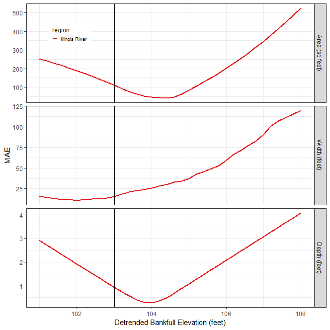

 

## Level 2 Estimate Bankfull Workflow
This chapter describes the tool workflows and processes steps to complete a Level 2 Estimate Bankfull (L2eb) FluvialGeomorph analysis. The purpose of this level is to estimate bankfull channel dimensions.  


## Create Initial Riffle Geometry
The purpose of this stage is to identify and map riffle cross sections and roughly estimate an initial bankfull elevation for the base event for each reach. 

### Create Riffle Floodplain
The purpose of this step is to identify riffle locations and map these cross sections across the lateral extent of the floodplain for each reach. 

A riffle is a shallow river landform where water flows in a steep, thin sheet [@luna_bergere_leopold_river_1957]. Riffles can be identified with the help of the `🗺️channel_slope` raster calculated in Level 1, and confirmed with high resolution aerial imagery. In the `🗺️channel_slope` raster, pools appear as relatively smooth areas of low slope due to the absence of LiDAR points (deep water absorbs laser pulses). Shallow water riffles appear as highly textured areas of relatively higher slope between pools due to the higher number of LiDAR points from the exposed bed material.

* Create a new line feature class named `🗺️riffle_floodplain`to store riffle cross sections. This feature class must use the same coordinate system as the vector datasets of the project. Add the following fields:
    * `📊ReachName`: 🧮Text (50)` - The purpose of this field is to store the reach name. 
    * `📊Seq`: `🧮long integer - The purpose of this field is to uniquely identify each cross section. 


**Riffle Identifying Characteristics:**  

* A straight reach between two meander bends, areas in the cross-overs between river bends
* Clear indicators of the active floodplain or bankfull discharge
* Presence of one or more terraces
* Channel section and form typical of the stream
* A reasonably clear view of of geomorphic features
* Areas of high water surface slope (in the case of high gradient streams)
* Areas of minimum depth and width
* Channel width parallel and consistent 
* Avoid tributary influences
* Cross sections should be drawn wide enough to capture the top of bank

**Digitize Riffles**

* Digitize riffle cross sections beginning with the left descending bank. While editing, use the "Reverse Direction" command (aka flip) to ensure riffles are digitized in the correct direction. 
* A red vertex denotes the end of a line segment. Therefore, the red end vertex should be on the right descending bank. 
* Check that each cross section is digitized in the correct direction (start at the left descending bank and end on the right descending bank) before going on to the next step. 
* Ensure that riffle cross sections are digitized to the full width of the active floodplain. Edit each `🗺️riffle_floodplain` feature to ensure that it extends at least to the edge of the `🗺️Floodplain Mask` layer, but no further. 
* This ensures that each `🗺️riffle_floodplain` feature covers the entire floodplain, but does not extend too far into the uplands.  
* For a site with multiple reaches, riffle cross sections must be uniquely numbered across all reaches. The `📊Seq` field values of riffle cross sections should not repeat within the reaches of a site. 
* The downstream-most cross section in the site should be numbered starting with the `📊Seq` field value of 1 and increase moving upstream. 
* If necessary, use the `🛠️ XS Resequence` tool to set the starting `Seq` value for each reach. 
* Set the `📊Seq` field value for each upstream reach to the upstream-most value (i.e., the highest `Seq` value of the downstream reach’s riffle cross section feature class) of the downstream reach. For example, set the `📊Seq` of the Reach-2 riffle cross section feature class to 18 if the maximum value of Reach-1’s riffle cross section feature class `📊Seq` field is 17.


### Assign Cross Section IDs
The purpose of this step is to ensure that riffle cross section identifiers are properly assigned. Assignment of cross section unique identifiers is critical for later tools to uniquely identify each cross section. 

* Assign integer values to the `Seq` field starting with one. Begin numbering at the downstream extent of the study area and moving upstream. 


### Calculate Cross Section Watershed Area
The purpose of this step is to calculate the watershed area for each riffle cross section. 

* From the study area geodatabase, use the `🗺️watershed_contributing_area` raster that covers the entire contributing watershed of the study area.    
* Use the ESRI `🛠️Clip Raster` tool to clip the `watershed_contributing_area` raster to `stream_network_buffer` to speed tool run time. 
* Add the `🗺️contributing_area_buffer` raster to a map and symbolize with a “hot-cold” stretch renderer.
* Add the `🗺️flowline`and regular cross section features classes to the map. Place them on top of the `🗺️contributing_area_buffer` raster. 
* Determine the maximum distance from the intersection of each cross section and the `🗺️flowline` to the nearest pixel of high flow in the `🗺️contributing_area_buffer` raster. This value will be used for the `📊snap_distance` in the next step. 
* Use the `🛠️XS Watershed Area` tool to calculate the watershed area for each cross section. 
* For the `📊flow_accum` parameter, use the `🧮contributing_area_buffer` raster. 
* For the `📊snap_distance` parameter, use the distance you calculated in a previous step.


### Calculate Cross Section River Position
The purpose of this step is to calculate the river position for each riffle cross section. 

* Use the `🛠️ XS River Position` tool to calculate the distance to the mouth of the river for each cross section. 
* The river position of each cross section will be used in later steps to calculate several channel parameters (i.e., gradient, sinuosity). 


### Create Riffle Channel
The purpose of this step is to edit the lateral extent of the `🗺️riffle_channel`feature class to just cover the initial channel extent. This allows a more detailed examination of the channel area. 

* In the Catalog window, make a copy of the `🗺️riffle_floodplain` feature class and name it `riffle_channel`.
* Edit each `🗺️riffle_channel` feature to ensure that it extends at least to the edge of the `Channel Mask` layer, but no further. This ensures that each `🗺️riffle_channel` feature covers the entire channel, but does not extend too far into the floodplain.
* Use snapping to ensure that vertices of the `🗺️riffle_channel` features are coincident with the overlapping `🗺️riffle_floodplain` features. 


### Calculate Cross Section Points
The purpose of this step is to convert each riffle cross section into a set of evenly stationed points and assign DEM and detrended elevation values.

* Use the `🛠️ XS Points`tool to calculate cross section station points for each cross section. 
* The `📊station_distance` parameter should be set to approximately the resolution of the DEM. For example, if the DEM has a cell size of 1 foot (0.3048 meter), set the `📊station_distance` to that distance (using the linear units of the coordinate system used for the project's vector data). 
* This tool creates a new feature class named `🗺️<cross section feature class name>_points`. 
* Repeat this step for both the `🗺️riffle_floodplain` and `🗺️riffle_channel` feature classes. 


### Calculate Initial Cross Section L2 Dimension
The purpose of this step is to calculate the initial L2 dimensions for the the riffle cross sections for each reach. Repeat the following steps for both the  `🗺️riffle_floodplain` and `🗺️riffle_channel` feature classes. 

**Determine the moving window size**    
Many stream metrics are scale dependent, meaning these metrics are affected by the size of the moving window used in their calculation. To determine the appropriate size of the moving window for this reach, use the following steps:

* Many stream metrics are typically calculated using a moving window size equal to two meander wavelengths. 
* Using the initial `Channel Mask` layer that you created earlier, estimate the typical bankfull width for the reach. 
* Estimate the length of two meander wavelengths by multiplying the bankfull width estimated in the last step by 10 (e.g., 30ft bankfull width * 10 = 300ft, two meander wavelengths).  
* Determine how many cross sections two meander wavelengths represent. For example, if riffle cross sections are spaced about 300ft apart, then two meander wavelengths would be 1 riffle cross section (i.e., 300ft / 300ft between riffle cross sections). 

**Calculate Initial L2 Dimensions**   

* Use the `🛠️15b - XS Dimensions, Level 2` tool to calculate L2 dimensions. 
* Set the `📊xs_fc` parameter to the 🗺️regular cross sections feature class you created in a previous step. 
* Set the `📊📊lead_n` parameter to the number of upstream cross sections that you calculated in a previous step. 
* If the elevations in the channel seem noisy, check the `📊use_smoothing` parameter and set the `📊loess_span` parameter to a value between `🧮0-1`. 
* Confirm that the `📊vert_units` of the DEM are in feet. 

**Confirm the degree of smoothing**   

* Use a chart to verify the choice of the smoothing `loess_span` parameter in the `🗺️*_dims_L2` feature class. 
* Right-click on the `🗺️*_dims_L2` feature class in the map table of contents and select "Create Chart", and select "📊Line". In the `📊Date or Number` dropdown, choose the field `📊POINT_M`. In the `📊Aggregation` dropdown, choose `🧮None`. In the `📊Numeric field(s)` checklist, check the boxes next to `🧮Z` and `🧮Z_smooth`. Click the "Apply" button to view the chart.
* Visually assess the degree of smoothing. The smoothing should be high enough to eliminate LiDAR elevation noise, but not so high as to eliminate meaningful channel elevation change. 
* If the smoothing is not ideal, re-run the tool and adjust the `📊loess_span` parameter. 


***

## Estimate Bankfull
The purpose of this stage is to estimate the detrended bankfull elevation for the base year for each reach. This report conducts a sensitivity analysis using the regional curve estimates of channel dimensions across a range of elevation values to identify the detrended bankfull elevation value that best fits the regional curve estimate. 

### Run the Estimate Bankfull Report
The purpose of this step is to run the Estimate Bankfull report for each reach. 

* In the `🛠️Reports` toolset, use the `🛠️L2 Estimate Bankfull` tool to produce the Estimate Bankfull Report. 
* For the `📊stream` parameter, use the value of the `📊ReachName` field used in the `🗺️flowline` feature class. 
* For the `📊flowline_fc` parameter, enter the `🗺️flowline` feature class for the base event survey. 
* For the `📊xs_dims_fc` parameter, use the `🗺️riffle_channel_dims_L2` feature class calculated for the base event. 
* The `📊xs_points_ch_*` parameter set requires a `🗺️riffle_channel_points` feature class. These feature classes should be entered with the feature class for the most recent survey first (i.e., the base event) and then the previous surveys in reverse chronological order (e.g., 2016, 2010, 2006). 
* The `📊xs_points_fp_*` parameter set requires a `🗺️riffle_floodplain_points` feature class. These feature classes should be entered with the feature class for the most recent survey first (i.e., the base event) and then the previous surveys in reverse chronological order (e.g., 2016, 2010, 2006). 
* The `📊survey_name_*` parameters are used to label the surveys in maps and graphs. 
* The feature classes and labels used for the `📊xs_points_*` and `📊survey_name_*` parameters must be entered in the same order (e.g., 2016, 2010, 2006) in each set of numbered parameters. 
* For the `📊features_fc` parameter, enter the `🗺️features` feature class for the base event survey. 
* For the `📊dem` parameter, enter the `🗺️hydroDEM` for the base event survey. 
* For the `📊regions` parameter, select the regions to use for estimating the bankfull water surface elevation. 
* For the `📊from_elevation` parameter, specify the lowest detrended elevation value to use for sensitivity analysis.
* For the `📊to_elevation` parameter, specify the highest detrended elevation value to use for sensitivity analysis.
* For the `📊by_elevation` parameter, specify the value to increment the sequence between `📊from_elevation` and `📊to_elevation`. 
* The three values (i.e., `📊from_elevation`, `📊to_elevation`, and `📊by_elevation`) define the sequence used for the sensitivity analysis. 
* For the `📊bf_estimate` parameter, specify the detrended elevation value that represents the bankfull water surface elevation. 


### Perform QA
The purpose of this step is to use the QA Checklist to verify the reports have run correctly and identify any data mistakes that need to be corrected. 

* Follow the instructions in the QA Checklist Chapter, "Estimate Bankfull Report" section, to verify that the reports have run correctly. 
* Make the required changes suggested in the QA Checklist and rerun the report. 
* Repeat these QA iterations until the reports are correct. 


### Determine Bankfull Elevation
The purpose of this step is to interpret the Estimate Bankfull Report to determine the final detrended bankfull elevation to be used for the rest of the analysis for each reach. The `🛠️L2 Estimate Bankfull`tool is intended to be run iteratively, testing the fit of a range of detrended bankfull elevations against different regional curves. 

* From the initial 🛠️Estimate Bankfull Report, use the Bankfull Elevation Goodness of Fit sensitivity analysis graph to examine the effect of choice of detrended bankfull elevation on the error statistic. 
* Identify the detrended bankfull elevation that minimizes error on the Bankfull Elevation Goodness of Fit sensitivity analysis graph. 
* In the example figure below, the detrended bankfull elevation of 104 ft. minimizes error (y-axis Mean Average Error) for both area and depth. Although 102 ft. appears to be the detrended elevation that minimizes error for width, 104 ft. does a better job for area and depth. Using the logic of "best two out three", a detrended bankfull elevation of 104 ft. could be chosen for this reach and will be used for later steps in this analysis. However, other criteria could be used depending on the goals of your study.
* Rerun the report using the value chosen in the previous step. 

```{r echo=FALSE, out.width="100%", fig.cap="Bankfull Elevation Goodness of Fit"}

```

