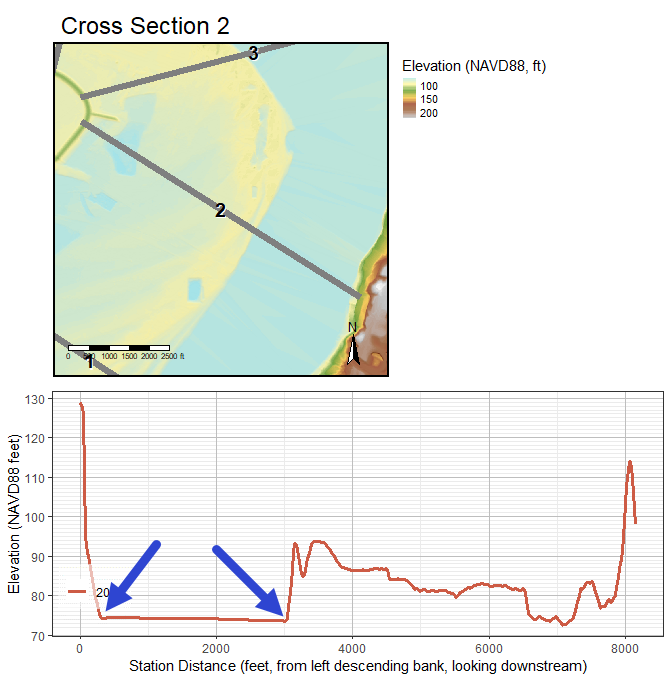
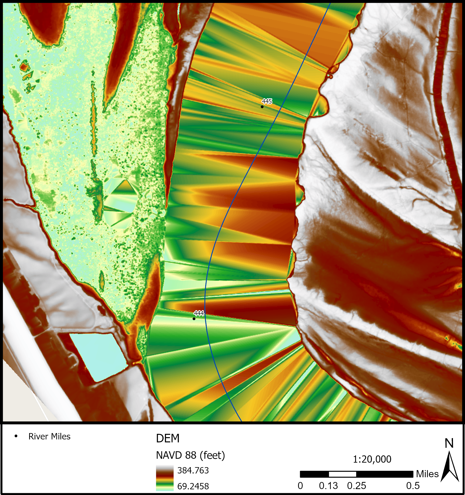

# Concepts

## Fluvial Geomorphology

This section will discuss the overarching concepts of fluvial geomorphology. These are not definitions but the functionality of terms and tools within the fluvial geomorphology toolbox. This section will describe the need and the why behind running the tools and the foundational information needed to understand the `FluvialGeomorph` workflows.

## Derived Features

The definition of a common set of derived features is an important step in standardizing any workflow. The standard `FluvialGeomorph` database objects form a tightly linked set of features that work together in a particular order to accomplish the analysis.

### Hierarchical Units of Analysis 
To help organize the workflow process we have defined several units of analysis:

-   **Study Area:** These are the primary work units and correspond to projects that customers have requested for analysis. Customers define specific goals for each project that determine the specific workflow chosen. These goals define a project study area for each project. These project study areas typically consist of a particular watershed, a mainstem section of a named river, or a discrete stream reach.

-   **Site:** Study areas are subdivided into "sites". Sites are typically named tributaries and their subwatersheds within the project study area.

-   **Reach:** Sites are further subdivided into "reaches". Reaches are defined according to project goals and use conventional rules for specifying reaches (i.e., tributary confluence to confluence), significant infrastructure, changes in surficial geology, etc.

-   **Survey Event:** `FluvialGeomorph` analysis is based on LiDAR terrain surveys, the timing of the survey is a critical factor in the analysis. LiDAR is a single point-in-time dataset. Since LiDAR can be collected periodically, our data structure must accommodate multiple distinct time periods (typically separated by years) for which channel dimensions are extracted. If there are multiple LiDAR surveys available for the project study area, the most recent survey is referred to as the *base year*. 

### Analysis Levels 

We have defined a standard workflow that is modular, allowing analysts to prescribe and customers to purchase progressively more detailed analysis as needed. The workflow is organized according to the following levels:

-   **Level 1:** Extract basic channel dimensions and profile.
-   **Level 2:** Extract bankfull channel dimensions and profile.
-   **Level 3:** Extract planform dimensions.

### Workflow Levels

The `FluvialGeomorph` workflow has been organized using the following hierarchical grouping to help analysts better understand how to perform the analysis and what is being done during each step of the process. All workflow steps are sequential and build on the outputs of previous steps.

-   **Levels:** The top hierarchical grouping of the workflow. Levels are distinguished by the degree of fluvial geometric detail and metrics that will be derived. Levels 2 and 3 are optional.
-   **Phases:** The second hierarchical grouping of the workflow. Each level is subdivided into phases. Phases are mostly a conceptual grouping of steps to accomplish a specific objective in the analysis chain.
-   **Steps:** the third hierarchical grouping of the workflow. Phases are subdivided into steps. steps typically involve running tools, manual editing, and performing quality assurance checks.
-   **Tools:** Tools are the lowest hierarchical grouping of the workflow. Tools perform operations that are suitable for automation.

### Flowline {#flowline-concept} 
Flowlines are smoothed stream network geometries derived from digital elevation models.

-   **Centerline:** The line that is equal distances between two banks in a stream. Generating cross sections along this line provides a full transverse view that extends beyond the bankfull width.
-   **Thalweg:** Thalwegs can be used to locate areas of scour and fill, geologic controls, and outcrops of non-erodible materials. The thalweg changes as the the concentration of flow due to centrifugal forces moves. Monitoring the thalweg allows  engineers or geomorphologists to chart changes in the bed elevation through time.

### Position Along River

Rivers and streams are dynamic and continuously change their position, shape, and other morphological characteristics. Creating cross sections from a flowline derived from flowline points establishes a position on an existing river for comparison of past and future variations during the lifetime of the project.

### Pool-Riffle-Run

-   **Pool:** In bends, there is a concentration of flow due to centrifugal forces. This causes the depth to increase at the outside of the bend, and this area is known as the pool. 
-   **Riffle:** As the thalweg again changes sides below a bend, it crosses the centerline of the channel. This area is known as the riffle or crossing. At the point of tangency between adjacent bends, the velocity distribution is fairly consistent across the cross section, which is approximately rectangular in shape. The concentration of flow in the bend is lost and the velocity decreases accordingly, thus causing deposition in the crossing. 
-   **Run:** A reach of stream characterized by fast-flowing, low-turbulence water. This includes deep areas in a stream where water flows fast with little or no turbulence. <!--need a more conceptual definitions-->

### Cross Section {#xs-concept}

While thalweg profiles are a useful tool it must be recognized that they only reflect the behavior of the channel bed and do not provide information about the channel as a whole. For this reason it is usually advisable to study changes in the cross sectional geometry. Cross sectional geometry refers to width, depth, area, wetted perimeter, hydraulic radius, and channel conveyance at a specific cross section. 

### Bankfull {#bankfull-concept}

The area between the side slopes of a channel which the streamflow is normally confined (the transition point between the bank and the floodplain). This convention must be addressed  when channel cross-sections are recorded, plotted, and entered into hydraulic computational programs. 

Describes the peak flow; the stage at which the channel is nearly full. The term, "Bankfull" modifies stage, width, channel, and discharge.

### Flood Prone {#flood-prone-concept}

Flood prone areas generally include the active floodplain and the low terrace. The elevation of the floodprone is qualitatively defines as 2 times the maximum bankfull depth. 

Includes the floodplain and active channel that is subjected to regular flooding, as indicated by topography, soil/substrate, and vegetation community. Changes in vegetation types, flood deposits of fine woody materials, and change in slope are often good indicators of the flood prone width. Changes in vegetation are typically presented as a transition from riparian vegetation to upland grasses and/or other mesic species that have lesser water requirements.

### Planform {#planform-concept} 
The pattern formed by a waterway as viewed from above. Channel pattern describes the planform of a channel. The primary types of planform are meandering, braided, and straight. In many cases, a stream will change pattern within its length. The type pattern is dependent on slope, discharge, and sediment load.

-   **Loops Contain Bends:** The change in direction of a stream channel. 
-   **Loops Have an Apex:** The area near the center of a bend. Usually measured by dividing the total arc angle of the bend by two; e.g., in a 90 degree bend the apex would be the section of the arc near 45 degrees. 
-   **Loops Alternate:** A meandering channel is formed by a series of alternating changes in direction, or bends. Relatively straight reaches of alluvial rivers rarely occur in nature. Streams meander within the banks of a straight section of the stream creating loops. Over time the alternating changes cause loops and bends to change positions.
-   **Crossovers:** The relatively short and shallow reach of a stream where the thalweg crosses from one bank to the other either between bends or between pools in a straight reach. 
The point of inflection in a meander. The point where the thalweg intersects the center line of the stream in crossing from near the outside of the next bend. The point of inflection in a meander where the thalweg intersects the centerline of the stream. 
-   **Valley Line:** The straight line length of the valley along the same reach as the survey length is measured. This is usually obtained by topographic map, or by measuring the straight-line distance from the upstream extent of the longitudinal survey to the downstream extent. Valley length is measured over the exact same reach as the survey length and can be entered at the same time that gradient survey is measured.

## Geospatial

### LiDAR Stream Measurement

Because near-infrared LiDAR does not penetrate the water surface, DEMs do not contain information about the channel depth, bed topography, and substrate size. The lowest elevation points from LiDAR are used to represent the water surface. The need for in-channel data for habitat monitoring and modeling fluvial processes requires high-resolution bathymetric LiDAR.

-   discuss the difference between water surface and channel bottom
-   diagram of stream

### Terrain Models

High-density, irregularly-spaced elevation mass points in Digital Terrain Models (DTMs) are routinely produced from LiDAR point clouds. Uniformly-gridded (raster) Digital Elevation Models (DEMs) are either interpolated from LiDAR mass points or compiled from stereo imagery.

-   point cloud
-   raster
-   surface models, terrain models

### Terrain Visualization {#terrain-visualization-concept}

Preserve Resolution and Detail.
Visualize differences in LiDAR derived elevations.
Accentuating the color ramp across the relevant range of elevation values.
To see features in some images or raster datasets, or to distinguish them more easily from the surroundings, you may want to alter the stretch applied to the histogram. Dynamic Range Adjustment (DRA) is a tool for stretching the pixel values within the display and while not using all the pixels in the raster dataset.

### Synthetic Stream Delineation {#synthetic-stream-concept}

Derive linework from terrain data.

### Flow Accumulation {#flow-accumulation-concept}

D8, D16, D-inf. How streams accumulate flow from the upstream to downstream ends.

### Hydro Modification {#hydro-modification-concept}

Modifying DEM to represent the flow of water through structures. Less resolute DEMs need more hydro modification. Inversely, more resolute DEMs need less hydro modification. The need for hydro modification is dependent on the type of structure. LiDAR collected at a high enough resolution can avoid hydro modification around bridges if the points collected can reach under the bridge on either side. Culverts and storm water structures interrupt visibility and prevent a full view of the flow of a stream and would require hydro modification.

### Relative Elevation Model {#REMing-concept}

Normalization/Standardization of an Elevation Model to an index value of 100 as the lowest value also known as the locally determined lowest elevation of the streamline so that the REM can be thought of as the Bank Height Model. 

-   "relative bank height"
-   figure: side-by-side DEM and REM
-   figure: side-by-side longitudinal profiles

### Hydraulic Modelling

-   Bathtub Assumption

### Water Surface Elevation

Since water almost completely absorbs LiDAR light pulses, areas of water are usually missing elevation data. However, this does not mean that water surface elevation (WSE) cannot be derived from or accurately represented in LiDAR datasets. The elevation of water areas in DEMs derived from LiDAR point clouds can be represented due to the acquisition of points along the water's edge. See Figure x1 for an illustration of where these points are located.

```{r echo=FALSE, fig.cap="LiDAR Points Acquired Close to the Water's Edge Define the Water Surface. Mississippi River, RM 435, Vicksburg, MS.", out.width="100%"}

```

The point cloud density will largely determine how accurately the water surface is captured, driven by the probability of capturing points as close to the water line as possible. In relatively low point cloud density LiDAR collections (\>=1m point cloud spacing) the water surface is often represented with artifacts. These artifacts are commonly referred to as TIN (Triangulated Irregular Networks) artifacts created when the DEM is derived. These occur when LiDAR points were not regularly acquired close to the water's edge. Sections of the banklines where LiDAR points were not acquired close to the water's edge will appear as triangular "humps" in the water surface. In Figure x2, these "hump" artifacts are clearly visible as reddish areas, while the lower elevation areas close to the water surface elevation appears as green and blue areas.

```{r echo=FALSE, fig.cap="DEM artifacts due to LiDAR points not being captured close enough to the water's edge. Mississippi River, RM 444-445.", out.width="100%"}

```

### Spatial Data Clearinghouses for Terrain Data

-   [3DEP](https://apps.nationalmap.gov/viewer/)
-   The National Map
-   State clearinghouses
