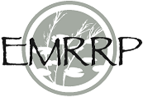

--- 
title: "FluvialGeomorph Technical Manual"
date: "`r Sys.Date()`"
author: 
  - Christopher Haring, Geomorphologist/Research Physical Scientist, Coastal Hydraulics Laboratory, U.S. Army Corps of Engineers
  - Michael Dougherty, Geographer, US Army Corps of Engineers, Rock Island District
site: bookdown::bookdown_site
output: bookdown::gitbook
url: 'https\://techmanual.fluvialgeomorph.org/'
github-repo: "FluvialGeomorph/FG-Tech-Manual"
favicon: "favicon.ico"
documentclass: book
bibliography: [book.bib, packages.bib]
biblio-style: chicago
link-citations: true
description: "This technical manual describes the technical background of the FluvialGeomorph toolbox."
---

```{r library, include=FALSE}
library(knitr)
library(png)
library(dplyr)
```

```{r import, include=FALSE}
dd_df     <- read.csv("data_dictionary.csv")
params_df <- read.csv("parameters.csv")
```

```{r table_functions, include=FALSE}
#' @title Creates a table of parameters for a tool.
#'
#' @param params_df       data frame; A data frame of parameters. Must have the
#'                        columns: tool, parameter_name, data_type, description, #'                        required. 
#' @param tool            character; The name of the tool whose parameters will
#'                        be displayed. 
#' @param caption         character; The text of the table caption for the 
#'                        output table. 
#'
#' @return A knitr::kable containing records for each of the parameters for the 
#' specified tool. Table includes parameter_name, data_type, description, 
#' required. 
#'
params_table <- function(params_df, tool, caption) {
  param_names <- c("Parameter", "Type", "Description", "Required")
  tool_dd <- filter(params_df, tool == !!tool) %>%
             select(parameter_name:required)
  kable(tool_dd, col.names = param_names,
        caption = caption)

}

#' @title Creates a table of fields for a feature class. 
#'
#' @param dd_df           data frame; A data dictionary data frame. Must have 
#'                        the columns: feature_class, field_name, type, 
#'                        description, units, level.
#' @param feature_class   character; The name of a feature class in the dd_df
#'                        feature_class.
#' @param caption         character; The text of the caption for the output 
#'                        table. 
#'
#' @return A knitr::kable containing records for each of the fields for the 
#' specified feature_class. Table includes field_name, type, description, units,
#' and level. 
#'
dd_table <- function(dd_df, feature_class, caption) {
  dd_col_names <- c("Field Name", "Type", "Description", "Units", "Level")
  fc_dd <- filter(dd_df, feature_class == !!feature_class) %>%
           select(field_name:level)
  kable(fc_dd, col.names = dd_col_names,
        caption = caption)
}
```


# Preface {-}
Funding for development and maintenance of FluvialGeomorph has been provided by the following US Army Corps of Engineers (USACE) programs:

* [Ecosystem Management and Restoration Research Program (EMRRP)](https://emrrp.el.erdc.dren.mil).
* [Regional Sediment Management Program (RSM)](https://rsm.usace.army.mil/)
* [Mississippi River Geomorphology and Potamology Program (MRG&P)](https://www.mvd.usace.army.mil/Missions/Mississippi-River-Science-Technology/MS-River-Geomorphology-Potamology/)
* [Flood Risk Management Program (FRM)](https://www.iwr.usace.army.mil/Missions/Flood-Risk-Management/Flood-Risk-Management-Program/)
* [Engineering With Nature (EWN)](https://ewn.el.erdc.dren.mil/)


```{r echo=FALSE}
knitr::include_graphics("images/USACE_200.png")


knitr::include_graphics("images/MRG&P_300.png")
knitr::include_graphics("images/FRMP_200.png")

knitr::include_graphics("images/EWN_200.png")
```


## Abstract
The [FluvialGeomorph ArcGIS toolbox](https://github.com/FluvialGeomorph/FluvialGeomorph-toolbox) provides a set of tools for conducting rapid fluvial geomorphology analysis and assessment. It allows a user to use high resolution, remotely sensed LiDAR (Light Detection and Ranging) terrain data to cost effectively extract stream channel dimensions at fine scale for large spatial extents. This document describes the methods used in the development of the FluvialGeomorph project. 


## Distribution Statement
Approved for public release; distribution is unlimited


## Unit Conversion Factors

Multiply               | By                | To Obtain
--------               | --                | ---------
feet                   | 0.3048            | meters
miles                  | 1.60934           | kilometers
square miles           | 2.58999           | square kilometers


Table: Unit Conversion Factors


## Notation List


***
